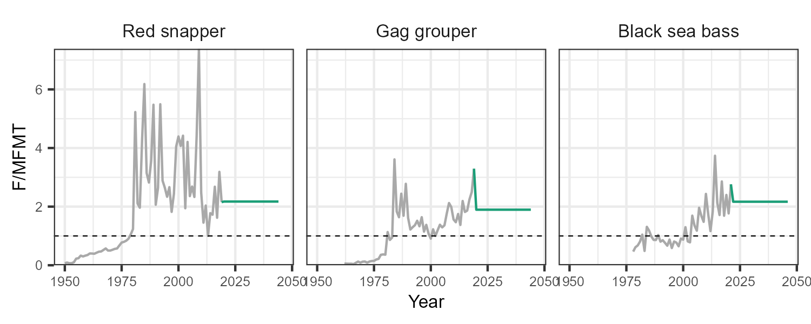

```{r setup, include=FALSE}
knitr::opts_chunk$set(echo = FALSE)
```

# Background

## Overall Objective

```{=tex}
\begin{exampleblock}{}
\large
\centering
Develop a Framework for Comparing the Expected Performance of Different Management Approaches for the Snapper-Grouper Fishery
\end{exampleblock}
```

## Management Strategy Evaluation (MSE)

```{=tex}
\large
\begin{itemize}
  \item Closed-Loop Simulation Testing
  \item Simulation Model of a Fishery System
  \item Project Forward with Different Management Methods
\end{itemize}
```

## Key Components

```{=tex}
\newcommand{\insm}{%
\smash{\raisebox{.5\dimexpr3\parskip}{$\left.\rule{0pt}{.3\dimexpr4\baselineskip+0\itemsep+0\parskip}\right\}$\ \parbox{1.5cm}{Operating Model (OM)}}}
}
```
```{=tex}
\begin{enumerate}
  \item Biological properties of the fish stocks 
  \item Characteristics of the fleets that exploit them %
\smash{\raisebox{.5\dimexpr 3\parskip}{$\left.\rule{0pt}{.3\dimexpr 4\baselineskip+0\itemsep+0\parskip}\right\}$\ \parbox{1.5cm}{Operating Model (OM)}}}

  \item Management options to consider
  \item Methods to summarize performance  
\end{enumerate}
```

## Stakeholder Consultation

```{=tex}
\large
\begin{itemize}
  \item Advisory Panel
  \item SSC
  \item Council
  \item Public Scoping Meetings
\end{itemize}
```


## Specific Aims

1. Develop MSE Framework for Snapper-Grouper Fishery
2. Use the Framework to:
\vspace{6pt}
    a. Build OMs for 3 Key Overfished Stocks
    b. Evaluate Rebuilding Potential Under:
    \vspace{6pt}
        - Status Quo Conditions
        - A Broad Range of Management Options
        - Core System Uncertainties
    d. Examine Trade-Offs between Rebuilding, Landings, and Discards

## Expected Outcomes

1. Evaluate Suitability of the MSE Framework
2. Quantify Probability of Rebuilding Under Range of Scenarios
2. Identify Management Options to Explore in More Detail
3. Determine Direction for Further Research
    

# Operating Models

## Selected Stocks

```{=tex}
\begin{figure}[!htb]
\minipage{0.32\textwidth}
  \includegraphics[width=\linewidth, height=1.8cm]{red-snapper.jpeg}
  \centering Red Snapper
\endminipage\hfill
\minipage{0.32\textwidth}
  \includegraphics[width=\linewidth, height=1.8cm]{gag_grouper.jpg}
  \centering Gag Grouper
\endminipage\hfill
\minipage{0.32\textwidth}%
  \includegraphics[width=\linewidth, height=1.8cm]{black_sea_bass.jpg}
  \centering Black Sea Bass
\endminipage
\end{figure}
```

## Fishing Fleets

\large 

1. Commercial Line
2. Recreational Headboat
3. General Recreational
4. Dive (Gag Only)

\vspace{16pt}

Dive Fleet not shown in Results

## Fishery Dynamics

\large

\textbf{Recent Assessment $\longrightarrow$ Operating Models }

\vspace{16pt}

```{=tex}
\begin{itemize}
  \item Red Snapper: SEDAR 73
  \item Gag Grouper: SEDAR 71
  \item Black Sea Bass: SEDAR 76
\end{itemize}
```
\vspace{16pt}

\noindent\fbox{%
    \parbox{\textwidth}{%
        \centering
\textbf{Base Case OM}
    }%
}

## Sensitivity Tests

\centering

```{r table2, echo=FALSE, message=FALSE, warnings=FALSE, results='asis'}
test_tbl <- data.frame(
  n= 1:5,
  A=c('Lower M', 
      'Higher M', 
      'Reduced. Rec. Removals',
      'Effort Creep',
      'Recent Recruitment'),
  B=c('Lower M from assessments' , 
      'Higher M from assessments', 
      'Gen. Rec. removals reduced by 40%',
      'Gen. Rec. effort increased by 2% per year',
      'Recruitment pattern based on 10 most recent years'))

knitr::kable(test_tbl, format = "latex", booktabs = T,
              col.names=c('', 'OM', 'Description')) |>
  kableExtra::kable_styling(font_size = 10,full_width = F,
                            latex_options = "striped") |>
  kableExtra::row_spec(row=0, bold=TRUE) |>
  kableExtra::column_spec(3, width='18em')
```

## Spatial Structure

```{=tex}
\begin{columns}[onlytextwidth,T]
  \begin{column}{.50\linewidth}
  \normalsize
  3 Geographic Regions  \\
  \vspace{12pt}
  2 Depth Zones
  \begin{itemize}
    \small
    \item Nearshore (NS) < 100 ft
    \item Offshore (OS) > 100 ft
  \end{itemize}      
  \end{column}
  \begin{column}{.55\linewidth}
    \includegraphics[width=\linewidth]{spatial_map.png}
  \end{column}
\end{columns}
```
\large Recruitment occurs in the Nearshore

# Management Scenarios

## Status Quo (SQ)

F fixed to geometric mean from last 3 years

```{r, out.width = '100%'}

```

## Modifications to SQ Management

\includegraphics[width=\linewidth]{management_options.png}

## Management Combinations

**12 Combinations:**

*1*. ***SQ***: Status Quo

*2*. ***SQ_FR***: Status Quo with Full Retention (no closed season)

*3*. ***SQ_MLL***: Status Quo with a Minimum Size Limit

***...***

*12*. ***SQ_FR_MLL_OS***: Status Quo with Full Retention, Minimum Size Limit, and all effort in Offshore

## Reduction in Effort for General Recreational Fleet

**11 Levels of Relative Effort:**

*1*. **100%** Effort remains at SQ level

*2*. **95%** Effort reduced by 5%

*3*. **90%** Effort reduced by 10%

***...***

*11*. ***5%*** Effort reduced by 95%

## Management Scenarios

\centering

**12** Management Combinations\
\vspace{8pt} x\
\vspace{8pt} **11** Levels of Gen. Rec. Effort\
\vspace{8pt} =\
\vspace{8pt} **132** Management Scenarios

# Summarizing Results

## Summarizing Results

1. Projection plots of median $\text{SB}/\text{Rebuilding Target}$
2. Projection plots of median Landings & Discards
3. Calculate Probability of Rebuilding

## Rebuilding

**Rebuilding Target**:

\small
- Red Snapper: $SB > SB_\text{F30\%}$ by 2044 
- Gag: $SB > SB_\text{MSY}$ by 2032
- Black Sea Bass: $SB > SB_\text{MSY}$ by 2032 (not under rebuilding plan)

**Minimum Stock Size Threshold** (MSST):

- Red Snapper: $0.75SB_\text{F30\%}$
- Gag: $0.75SB_\text{MSY}$
- Black Sea Bass: $(1-M)SB_\text{MSY}$

## Historical SSB relative to Rebuilding Target

\includegraphics[width=\linewidth]{../img/SB_Hist.png}

# Results

## Prob. of Rebuilding by Target Year

All 132 management options for Base Case OM:

\includegraphics[width=\linewidth]{../img/Rebuild_Matrix.png}

## Prob. of Rebuilding by Target Year

\includegraphics[width=\linewidth]{../img/Rebuild_Matrix_2.png}

1. \textcolor{gggreen}{Status Quo (SQ)}
1. \textcolor{ggred}{SQ with Gen. Rec. Effort reduced to 35\%}
1. \textcolor{ggpurple}{SQ with Fishing Offshore}
1. \textcolor{ggblue}{SQ with Fishing Offshore and Full Retention}

## 1. Status Quo: Rebuilding

\includegraphics[width=\linewidth]{../img/SB_SQ.png}


## 1. Status Quo: Landings & Discards

\includegraphics[width=\linewidth]{../img/Landings.png}

## 1. Status Quo: Landings & Discards

\includegraphics[width=0.9\linewidth]{../img/Landings_fleets.png}

## 1. Status Quo: Landings & Discards

\includegraphics[width=0.9\linewidth]{../img/Landings_fleets_recent.png}


## 2. Gen. Rec. Effort 35%: Rebuilding

\includegraphics[width=\linewidth]{../img/SB_SQ_0.65.png}

## 2. Gen. Rec. Effort 35%: Landings & Discards

\includegraphics[width=0.9\linewidth]{../img/Landings_SQ_0.65_fleets.png}


## 3. SQ Offshore: Rebuilding

\includegraphics[width=\linewidth]{../img/SB_SQ_OS.png}

## 3. SQ Offshore: Landings & Discards

\includegraphics[width=0.9\linewidth]{../img/Landings_SQ_OS_fleets.png}


## 4. SQ OS & Full Retention: Rebuilding

\includegraphics[width=\linewidth]{../img/SB_SQ_FR_OS.png}


## 4. SQ OS & Full Retention: Landings & Discards

\includegraphics[width=0.9\linewidth]{../img/Landings_SQ_FR_OS_fleets.png}


## Sensitivity Tests


```{r table3, echo=FALSE, message=FALSE, warnings=FALSE, results='asis'}
test_tbl <- data.frame(
  n= 1:5,
  A=c('Lower M', 
      'Higher M', 
      'Reduced. Rec. Removals',
      'Effort Creep',
      'Recent Recruitment'),
  B=c('Lower M from assessments' , 
      'Higher M from assessments', 
      'Gen. Rec. removals reduced by 40%',
      'Gen. Rec. effort increased by 2% per year',
      'Recruitment pattern based on 10 most recent years'))

knitr::kable(test_tbl, format = "latex", booktabs = T,
              col.names=c('', 'OM', 'Description')) |>
  kableExtra::kable_styling(font_size = 10,full_width = F,
                            latex_options = "striped") |>
  kableExtra::row_spec(row=c(0,3,5), bold=TRUE) |>
  kableExtra::column_spec(3, width='16em')

```

## Sensitivity 3: Reduced. Rec. Removals 

\includegraphics[width=0.9\linewidth]{../img/SB_Hist_LowerRec1.png}


## Sensitivity 3: Reduced. Rec. Removals 

\includegraphics[width=0.9\linewidth]{../img/SB_Hist_LowerRec2.png}


## Sensitivity 3: Reduced. Rec. Removals 

Status Quo

\includegraphics[width=\linewidth]{../img/SB_LowerRec.png}


## Sensitivity 5: Recent Recruitment

Status Quo

\includegraphics[width=\linewidth]{../img/SB_Rec1_SQ.png}

## Sensitivity 5: Recent Recruitment

\includegraphics[width=\linewidth]{../img/Rebuild_Matrix_LowerRec.png}


# Discussion

## Status Quo

\small
\begin{columns}[onlytextwidth,T]
\begin{column}{.60\linewidth}
\begin{enumerate}
\item Red Snapper
\begin{itemize}
\item low prob. of rebuilding
\item decline in biomass and landings
\item relatively high discards
\end{itemize} 
\item Gag
\begin{itemize}
\item low prob. of rebuilding
\item slight increase biomass
\item gradual increase in landings
\end{itemize} 
\item Black Sea Bass
\begin{itemize}
\item $15$ prob. $SB>SB_\text{MSY}$ by 2032
\item increasing biomass and landings
\item relatively high discards
\end{itemize} 
\end{enumerate}
\end{column}
\begin{column}{.45\linewidth}
\vspace{78pt}

\end{column}
\end{columns}

## Status Quo

\small
\begin{columns}[onlytextwidth,T]
\begin{column}{.60\linewidth}
\begin{enumerate}
\item Red Snapper
\begin{itemize}
\item low prob. of rebuilding
\item decline in biomass and landings
\item relatively high discards
\end{itemize} 
\item Gag
\begin{itemize}
\item low prob. of rebuilding
\item slight increase biomass
\item gradual increase in landings
\end{itemize} 
\item Black Sea Bass
\begin{itemize}
\item $15$ prob. $SB>SB_\text{MSY}$ by 2032
\item increasing biomass and landings
\item relatively high discards
\end{itemize} 
\end{enumerate}
\end{column}
\begin{column}{.3\linewidth}
\vspace{64pt}
\begin{exampleblock}{}
Rebuilding requires reduction in F and/or increase in spawning output
\end{exampleblock}
\end{column}
\end{columns}

## Reducing General Recreational Effort 

1. Largest impact on *Red Snapper* 
2. General increase in biomass & landings (except Gen. Rec.)
3. Reduction in discards (RS & BSB; Gen Rec.)
4. *Black Sea Bass* & *Gag*
    - *Gag*: Commercial Line highest catches
5. Relative increase in landings for other fleets

## Full Retention

1. No closed fishing season; all catch retained; no discarding
2. Short-term increase in landings
3. Decreased probability of rebuilding:
    - all caught fish are removed from population rather than a fraction that survive discarding
4. Other options could be explored:
    - aggregate bag limits
    - closed seasons

## Minimum Size Limits

1. *Red Snapper*: Not very effective without reduction in discard mortality
2. *Gag & Black Sea Bass*: Similar to Status Quo
3. Other options could be explored:
    - fleet- and/or area-specific MLL
    - reductions in discard mortality
 
## Spatial Fishing Effort

1. *Red Snapper & Black Sea Bass*: shifting effort to Offshore largest increase in rebuilding
2. *Gag*: significant increase in rebuilding; shifting to Nearshore most effective
3. Largest impact caused by:
    - shifting fishing mortality to older fish; decreased impact on juveniles (esp. RS)
    - increase in reproductive output
    - effectively reducing F on a fraction of stock

## Sensitivity Tests

1. Assumed recruitment patterns in projection period highly influential
2. Quantitative results are different, but qualitatively the same finding:
    - reduce overall fishing mortality and/or shift effort from small/young fish
3. All OMs conditional on recent stock assessments


## Thanks & Acknowledgements

\centering \Large

**Thank You**
  
  \vspace{16pt}

\centering \Large

Questions?  
  
  \vspace{28pt}

\footnotesize
Thanks to the Snapper-Grouper MSE Technical Team, AP, SSC, Council, and all others who have provided input in to this process. We are grateful to the SAMFC Council for funding this project.
