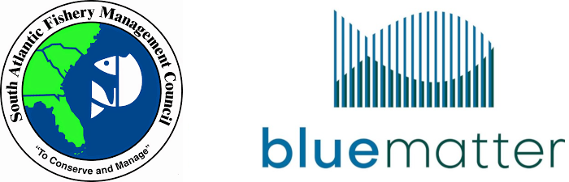

<!-- README.md is generated from README.Rmd. Please edit that file -->

# SAMSE

<!-- badges: start -->
<!-- badges: end -->



## Introduction

The [South Atlantic Fishery Management Council](https://safmc.net/)
(SAFMC) is working with [Blue Matter Science
Ltd.](https://www.bluematterscience.com/) to conduct a Management
Strategy Evaluation (MSE) to describe the expected outcomes of different
management approaches for the Snapper-Grouper Fishery.

This `SAMSE` R package includes all the code to run the MSE analysis.
`SAMSE` builds age-structured, spatial and multispecies, operating
models (OMs) from the output of Beaufort Assessment Models (BAM). The
OMs are projected under forwarded different management scenarios and
performance statistics are used to compare the performance of different
management approaches.

`SAMSE` uses the [openMSE](https:://openMSE.com) platform to build the
OMs and conduct the closed-loop simulation testing.

Documentation on building the OMs, specifying the management methods,
and running the closed-loop simualation testing is available under the
**Articles** menu on the top navigation bar.

## Installation

You can install the SAMSE from [GitHub](https://github.com/) with:

``` r
# install.packages("remotes")
remotes::install_github("Blue-Matter/SAFMC-MSE")
```

## MSE Technical Group Members

| Name              | Email                          | Role                          |
|:------------------|:-------------------------------|:------------------------------|
| Adrian Hordyk     | <adrian@bluematterscience.com> | Lead MSE Analyst              |
| Quang Huynh       | <quang@bluematterscience.com>  | Supporting MSE Analyst        |
| Tom Carruthers    | <tom@bluematterscience.com>    | Supporting MSE Analyst        |
| Chip Collier      | <chip.collier@safmc.net>       | SAFMC Lead                    |
| Cassidy Peterson  | <cassidy.peterson@noaa.gov>    | MSE Specialist                |
| Erik Williams     | <erik.williams@noaa.gov>       | Stock Assessment Specialist   |
| Christina Wiegand | <christina.wiegand@safmc.net>  | Social Scientist              |
| Scott Crosson     | <scott.crosson@noaa.gov>       | Economist                     |
| Mike Larkin       | <michael.larkin@noaa.gov>      | Data Analyst                  |
| Kai Lorenzen      | <klorenzen@ufl.edu>            | Meeting Moderator/Facilitator |
| Mike Schmidtke    | <mike.schmidtke@safmc.net>     | SAFMC Fishery Scientist       |
| Judd Curtis       | <judd.curtis@safmc.net>        | SAFMC Fishery Scientist       |
| Allie Iberle      | <allie.iberle@safmc.net>       | SAFMC Fishery Scientist       |
