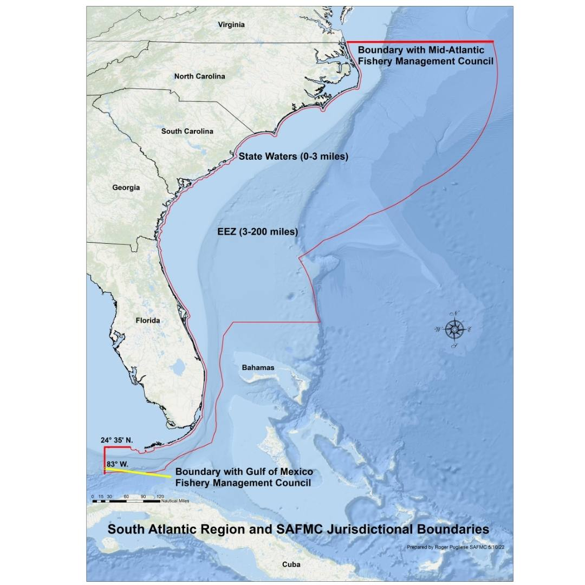
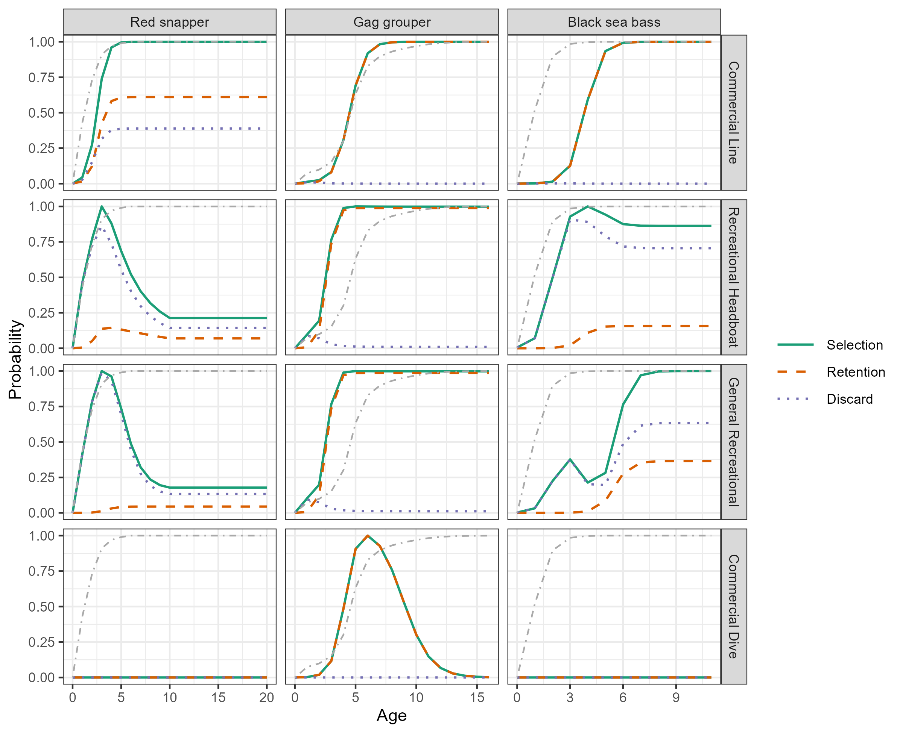
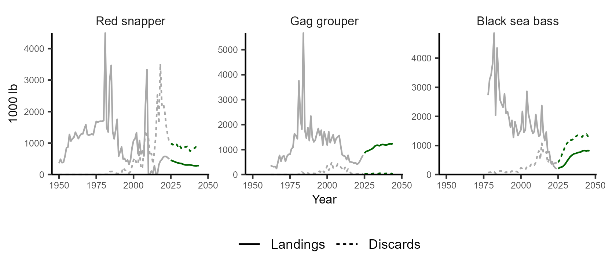
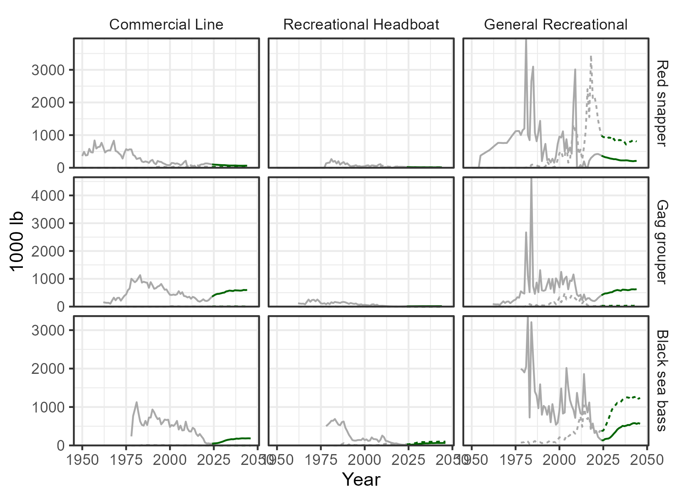
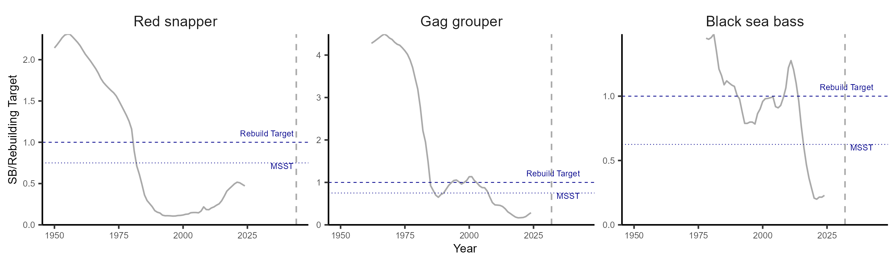
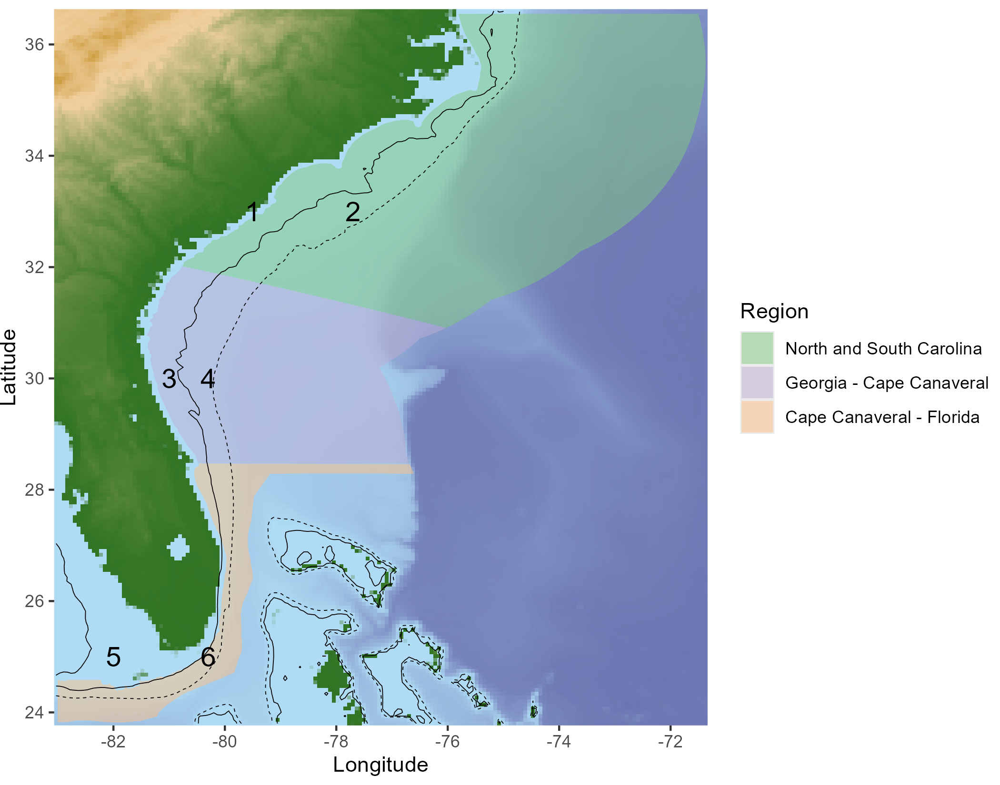
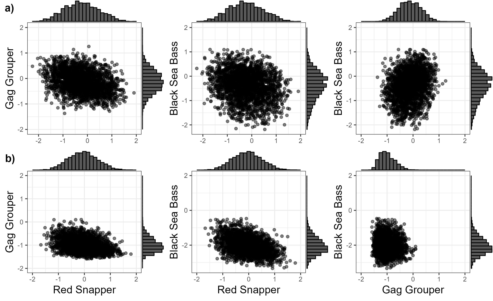
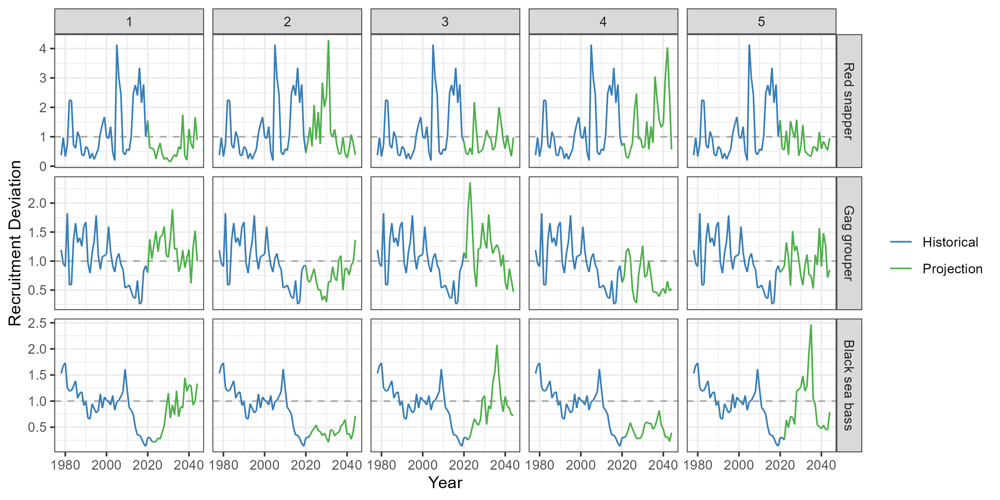

```{css, echo=FALSE}
.csl-entry {
    margin-bottom: 12px;
}

.book .book-body .page-inner {
    max-width: 1200px;
}

```

```{r, include=FALSE}
library(SAMSE)
knitr::opts_chunk$set(echo=FALSE, warning=FALSE, include=FALSE)
options(scipen=999)

```


# Introduction

The South Atlantic Fishery Management Council has started a Management Strategy Evaluation (MSE) process for the Snapper-Grouper fishery, currently managed under the [Snapper-Grouper Fishery Management Plan](https://safmc.net/fishery-management-plans/snapper-grouper/). The Snapper-Grouper fishery includes 55 species of snappers, groupers, and other species.

This document describes the technical specifications of the MSE process. It is a living document that will be continually updated to reflect the current state of the MSE work. Comments, questions, and feedback are welcome by contacting the [MSE Technical Group Members](https://safmc-mse.bluematterscience.com/).

More information on the MSE process can be found on the [SAFMC Snapper-Grouper MSE homepage](https://safmc-mse.bluematterscience.com/).

There are three main components in an MSE analysis:

1.  **Operating Models (OMs)**

    Operating models contain a mathematical description of the fishery system, including the biology of the fish stock, the historical exploitation pattern by the fishing fleet(s), and the observation processes used to collect the fishery data. The OMs also include the assumptions for the data collection process in the forward projections, and any implementation error for implementing the management advice in the forward projections.

    An MSE process usually includes a number of different operating models, each representing a different hypothesis about the potential fishery dynamics. The OMs should span the key uncertainties in the fishery system. By including these uncertainties, the MSE can identify a management approach that is robust to these uncertainties.

2.  **Management Procedures (MPs)**

    Management procedures are a set of rules that convert fishery data into management advice, e.g., a total allowable catch limit (TAC), a size limit, an effort control, a spatial closure, or some combination of different management measures. The main goal of MSE is to evaluate the performance of different MPs and identify the MP that is most robust to the uncertainty in the system.

3.  **Performance Metrics (PMs)**

    Performance metrics are used to evaluate the performance of the management procedures. PMs are quantitative metrics than can be calculated within the MSE framework and be used to evaluate and compare the performance of the CMPs.


# The `SAMSE` R Package

All code related to the MSE process is available in the [SAFMC-MSE Github Repository](https://github.com/Blue-Matter/SAFMC-MSE).

The [SAFMC-MSE Github Repository](https://github.com/Blue-Matter/SAFMC-MSE) includes an R package called `SAMSE`, which contains all code for running the closed-loop simulations and examining the results. This package can be installed directly from GitHub:

```{r, eval=FALSE, echo=TRUE, include=TRUE}
install.packages('remotes')
remotes::install_github('blue-matter/SAMSE')
```

The `SAMSE` package uses `openMSE` framework. `openMSE` is an R package that has been developed for conducting fast, flexible, and transparent, MSE for a wide range of fisheries. `openMSE` is an umbrella package that includes the `MSEtool`, `SAMtool` and `DLMtool` packages. A non-technical description of `openMSE` and its key features is available on the [`openMSE` website](https://openmse.com/).

The operating model in `openMSE`, including assumptions and equations, is described in detail in [Carruthers and Hordyk, 2018](https://besjournals.onlinelibrary.wiley.com/doi/epdf/10.1111/2041-210X.13081).

# Species included in the MSE

The MSE process is currently focused on three species:

1.  Red Snapper (*Lutjanus campechanus*)

2.  Gag Grouper (*Mycteroperca microlepis*)

3.  Black Sea Bass (*Centropristis striata*)

The MSE framework has been designed so that it can be easily expanded to include additional species.

The most recent stock assessments for these three stocks are [SEDAR 73](https://sedarweb.org/assessments/sedar-73/), [SEDAR 71](https://sedarweb.org/assessments/sedar-71/), and [SEDAR 76](https://sedarweb.org/documents/sedar-76-stock-assessment-report-south-atlantic-black-sea-bass/) for Red Snapper, Gag Grouper, and Black Sea Bass respectively.

The fisheries are managed under the [Snapper-Grouper Fishery Management Plan](https://safmc.net/fishery-management-plans/snapper-grouper/), which includes snappers, groupers and related demersal species of the continental shelf of the SE United States exclusive economic zone (EEZ), extending from the North Carolina/Virginia border through to the Atlantic size of the Florida Keys 83° W longitude (Figure \@ref(fig:eez)).

```{r eez, fig.cap='The geographical area of management for the South Atlantic Fishery Management Council.', include=TRUE}

```

<!-- ## Overview of Red Snapper Management -->

<!-- The Red Snapper fishery has separate management for the recreational and commercial sectors. -->

<!-- The regulations for the recreational fishery are set each year. If NOAA Fisheries determines that a season is allowed, the recreational season for the Red Snapper fishery opens the second Friday in July. The recreational sector season length varies based on previous years landings. The recreational season in 2022 and 2023 was 2 days. The season was then closed until the following July. The recreational fishery is managed with a bag limit of one fish per day per angler. -->

<!-- The commercial fishery has a 75 lb gutted weight trip limit, and a commercial annual catch limit (ACL; 124,815 lbs whole weight in 2023). The commercial fishery opens the second Monday in July. The commercial fishery remains open until the ACL is met. In recent years (2022 and 2023), the commercial fishery has closed in August is closed until the following year. -->

<!-- The Red Snapper fishery currently does not have a size limit for the recreational or commercial sectors. -->

<!-- The annual catch limit for the entire stock is split between the recreational (71.93%) and the commercial (28.07%) fleets. -->

<!-- More information on the current management regulations for the Red Snapper fishery is available [here](https://safmc.net/species/snapper-red/). -->

<!-- ## Overview of Gag Grouper Management -->

<!-- The Gag Grouper fishery has separate management for the recreational and commercial sectors. -->

<!-- The recreational fishery is closed to retention from the beginning of of January 1 through April 30 each year. Recreational fishers have a bag limit of 1 fish per person per day. -->

<!-- The commercial fishery is closed to retention from the beginning of January 1 through April 30 each year. Commercial fishers have a trip limit of 1000 lbs (gutted weight). -->

<!-- A minimum legal length of 24 inch (total length) in in place for both commercial and recreational fishers. -->

<!-- The annual catch limit for the entire stock is split between the recreational (49%) and the commercial (51%) fleets. -->

<!-- More information on the current management regulations for the Gag Grouper fishery is available [here](https://safmc.net/species/grouper-gag/). -->

# Process for Generating Operating Models

The operating models (OMs) used in the MSE are age-structured, with for spatial structure and age-based movement. The OMs were generated by importing the most recent assessments ([SEDAR 73](https://sedarweb.org/assessments/sedar-73/), [SEDAR 71](https://sedarweb.org/assessments/sedar-71/), and [SEDAR 76](https://sedarweb.org/documents/sedar-76-stock-assessment-report-south-atlantic-black-sea-bass/) for Red Snapper, Gag Grouper, and Black Sea Bass respectively) into the MSE framework. The assessments were conducted with the [Beaufort Assessment Model (BAM)](https://repository.library.noaa.gov/view/noaa/4847) and the fishery dynamics in the operating models exactly matched the output of the stock assessments.

A full description of the process used to generate the operating models, including the code to reproduce the operating models, are available [here](https://safmc-mse.bluematterscience.com/articles/Building-Base-Case-Operating-Models.html). Operating models for other species can be added to the MSE framework by following this process.

# Base Case Operating Model

The Base Case operating model was based directly on the respective SEDAR assessments for each species, following the process described above. This section summarizes the main properties of the Base Case OM.

Alternative operating models are developed as modifications of the Base Case OM. These alternative operating models are intended to span the critical uncertainties in the knowledge of the fishery systems, and are described in Section \@ref(altoms).

## Selectivity and Retention Schedules

Figure \@ref(fig:Select) show the selectivity- and retention-at-age curves in the last historical year for each of the stocks in the multi-species operating model.

The selectivity and retention curves remain the same in the projection period unless changed by a management procedure. Retention curves with a maximum value less than one indicate a general level of discarding.

```{r Select, fig.cap='The selectivity- (solid), retention-at-age (dashed), and dead discard (dotted) curves for three stocks in the multi-species operating model. The plot shows the curves from the terminal year of the assessments. The dash-dot grey line shows the maturity-at-age schedule for each stock.', include=TRUE}

```

## Removals, Landings, and Discards

Figure \@ref(fig:plotRemovalshist) shows the historical overall landings and discards for the multi-species Base Case operating model. Figure \@ref(fig:plotFleetRemovalshist) shows the historical overall landings and discards by fleet.

```{r plotRemovalshist, fig.cap='The overall landings and dead discards (1,000 lb) from the historical period the multi-species operating model.', include=TRUE}

```

```{r plotFleetRemovalshist, fig.cap='The landings (1,000 lb) by fleet from the historical period of the multi-species operating model. Note the different scale on the y-axes.', include=TRUE}

```

## Biological Reference Points

The reference points are calculated following the same method described in the SEDAR reports. This section describes the calculation of reference points for the species within the operating model.

### Red Snapper

The maximum fishing mortality threshold (MFMT) for Red Snapper is defined by the SAMFC as $F_{30\%}$, and the minimum stock size threshold (MSST) as $75\%\text{SSB}_{F30\%}$. Overfishing is defined as F \> MFMT and overfished as SSB \< MSST, with $\text{SSB}_{F30\%}$ defined as the rebuilding target.

### Gag Grouper

The maximum fishing mortality threshold (MFMT) for Gag Grouper is defined by the SAMFC as $F_{\text{MSY}}$, and the minimum stock size threshold (MSST) as $75\%\text{SSB}_{\text{MSY}}$. Overfishing is defined as F \> MFMT and overfished as SSB \< MSST. The rebuilding target is $\text{SSB}_\text{MSY}$.

### Black Sea Bass

Similar to Gag Grouper, the MFMT for Black Sea Bass is defined as $F_\text{MSY}$. However, the MSST for this stock is defined as $(1-M)\text{SSB}_\text{MSY}$ , where $M$ is the natural mortality rate. The rebuilding target is $\text{SSB}_\text{MSY}$.

## Biomass and Reference Points

Figure \@ref(fig:plotSBref) shows the historical spawning biomass, as estimated by the assessments, relative to the rebuilding targets for each stock.

```{r plotSBref, fig.cap='The historical spawning biomass relative to the rebuilding target for each stock. The horizontal lines indicate the reference points.', include=TRUE}

```

# Spatial Structure

The SEDAR assessments do not include spatial structure. Consequently, information on the spatial distribution and movement of the stocks has to be obtained from elsewhere, and the spatial structure added into the operating model developed from the SEDAR assessments.

The spatial structure of the MSE has been defined as 6 areas, including 3 geographic regions (Figure \@ref(fig:spatialareas)) and a Nearshore (\<100ft) and Offshore (\>100ft) component for each region (black line in Figure \@ref(fig:spatialareas)).

```{r spatialareas, fig.cap='The six spatial areas defined in the MSE, with three geographic regions (colors) and a division of each in Nearshore (<100ft) and Offshore (>100ft) (black line).', include=TRUE}

```

# Assumptions for Projection Dynamics

## Recruitment Process Error

The variance-covariance matrix was estimated from the historical log recruitment deviations of each species in the analysis. A truncated multivariate normal distribution, truncated at 2 standard deviations, was then used to generate correlated random log recruitment deviations for the projection period, with the standard deviation and lag-1 auto-correlation factor reported by the stock assessments (Figure \@ref(fig:recdevs)).

```{r recdevs, fig.cap='Scatter plots of the log recruitment deviations for each stock.', include=TRUE}

```

Figure \@ref(fig:rec-dev-example) shows an example of the historical and projection recruitment deviations for the three stocks in the operating model.

```{r rec-dev-example, fig.cap='An example of the recruitment deviations for a single simulation for the three stocks in the Base Case OM. The blue lines indicates the recruitment deviations during the historical period (identical across all simulations). The green lines indicates the recruitment deviations in the projection period.', include=TRUE}

```

## Life-History

In the Base Case OM, the life-history parameters in the projections are assumed to be stationary; i.e., remain at the same values as the terminal historical year.

## Selectivity

The selectivity pattern of each fleet in the projection period is assumed to remain unchanged from the terminal historical year, unless the selectivity or retention curve is modified by a management procedure.

## Implementation Error

The Base Case OM does not assume any implementation error.

Any error in the implementation of management regulations set by the Management Procedures is set within the MPs.

## Observation Error

Currently the Base Case OM assumes no observation error on the simulated data. This assumption will be revised when management procedures that use specific data to set management advice are developed.

# Additional Operating Models {#altoms}

The additional operating models are developed as variations of the Base Case OM, and are intended to span the key uncertainties in the understanding of the fishery system.

The uncertainties considered in the additional operating models have been identified from the most consequential sensitivity tests in the recent stock assessments, and from discussions with the Snapper-Grouper Advisory Panel.

```{r}
OMdat <- read.csv('../OM_details/OM_descriptions.csv')
```

Currently `r nrow(OMdat)` operating models (including the Base Case) have been developed. Table \@ref(tab:omdesc) provides a summary of the operating models. The sub-sections below describe more details for each of the additional operating models.

```{r omdesc, include=TRUE}
knitr::kable(OMdat, caption='Summary of the operating models developed for the MSE.')
```


# Performance Metrics

Four performance metrics have been defined to calculate the relative performance of the alternative management approaches (Table \@ref(tab:PM-table)).

| Name                         | Description                                                                                                                                                                            |
|:----------------------|:-------------------------------|
| Probability Rebuild          | Probability the spawning stock biomass (SSB) rebuilds to the minimum stock size threshold (MSST) by the target year (2044 for red snapper, and 2032 for gag grouper and black seabass) |
| Relative Short-Term Landings | The median landings in the first 5 years of the projections (2025 – 2029) relative                                                                                                     
                                to the mean landings from the last 3 historical years                                                                                                                                   |
| Relative Long-Term Landings  | The median landings in the 2035 – 2039 relative to the mean landings from the last 3 historical years                                                                                  |
| Fraction Discarded           | The median fraction of the total removals that were discarded dead                                                                                                                     |

: (#tab:PM-table) The performance metrics defined for evaluating the performance of the alternative management approaches.

