```{css, echo=FALSE}
.csl-entry {
    margin-bottom: 12px;
}

.book .book-body .page-inner {
    max-width: 1200px;
}

```

```{r, include=FALSE}
library(SAMSE)
knitr::opts_chunk$set(echo=FALSE, warning=FALSE, include=FALSE)
options(scipen=999)

```

```{r intialize}
source('../Build_Package/1b. Set OM Parameters.R')
```


# Introduction
The South Atlantic Fishery Management Council has started a Management Strategy Evaluation (MSE) process for the Snapper-Grouper fishery, currently managed under the [Snapper-Grouper Fishery Management Plan](https://safmc.net/fishery-management-plans/snapper-grouper/). The Snapper-Grouper fishery includes 55 species of snappers, groupers, and other species. 

This document describes the technical specifications of the MSE process. It is a living document that will be continually updated to reflect the current state of the MSE work. Comments, questions, and feedback are welcome by contacting the [MSE Technical Group Members](https://safmc-mse.bluematterscience.com/). 

More information on the MSE process can be found on the [SAFMC Snapper-Grouper MSE homepage](https://safmc-mse.bluematterscience.com/).


There are three main components in an MSE analysis:

1. **Operating Models (OMs)**

    Operating models contain a mathematical description of the fishery system, including the biology of the fish stock, the historical exploitation pattern by the fishing fleet(s), and the observation processes used to collect the fishery data. The OMs also include the assumptions for the data collection process in the forward projections, and any implementation error for implementing the management advice in the forward projections.
    
    An MSE process usually includes a number of different operating models, each representing a different hypothesis about the potential fishery dynamics. The OMs should span the key uncertainties in the fishery system. By including these uncertainties, the MSE can identify a management approach that is robust to these uncertainties.
   
2. **Management Procedures (MPs)**

    Management procedures are a set of rules that convert fishery data into management advice, e.g., a total allowable catch limit (TAC), a size limit, an effort control, a spatial closure, or some combination of different management measures. The main goal of MSE is to evaluate the performance of different MPs and identify the MP that is most robust to the uncertainty in the system.

3. **Performance Metrics (PMs)**

    Performance metrics are used to evaluate the performance of the management procedures. PMs are quantitative metrics than can be calculated within the MSE framework and be used to evaluate and compare the performance of the CMPs.
    
This document describes the OMs, MPs, and PMs that have been developed for the SAFMC Snapper-Grouper MSE.


# The `SAMSE` R Package

All code related to the MSE process is available in the [SAFMC-MSE Github Repository](https://github.com/Blue-Matter/SAFMC-MSE). 

The [SAFMC-MSE Github Repository](https://github.com/Blue-Matter/SAFMC-MSE) includes an R package called `SAMSE`, which contains all code for running the closed-loop simulations and examining the results. This package can be installed directly from GitHub: 

```{r, eval=FALSE, echo=TRUE, include=TRUE}
install.packages('remotes')
remotes::install_github('blue-matter/SAMSE')
```

The `SAMSE` package uses `openMSE` framework. `openMSE` is an R package that has been developed for conducting fast, flexible, and transparent, MSE for a wide range of fisheries. `openMSE` is an umbrella package that includes the `MSEtool`, `SAMtool` and `DLMtool` packages. A non-technical description of `openMSE` and its key features is available on the [`openMSE` website](https://openmse.com/). 

The operating model in `openMSE`, including assumptions and equations, is described in detail in [Carruthers and Hordyk, 2018](https://besjournals.onlinelibrary.wiley.com/doi/epdf/10.1111/2041-210X.13081). 


# Species included in the MSE
The MSE process is currently focused on two species: 

1. Red Snapper (*Lutjanus campechanus*) 
2. Gag Grouper (*Mycteroperca microlepis*)

The MSE framework has been designed so that it can be easily expanded to include additional species.

The most recent stock assessments for these two stocks were conducted in 2021 ([SEDAR 73](https://sedarweb.org/assessments/sedar-73/) and [SEDAR 71](https://sedarweb.org/assessments/sedar-71/) for Red Snapper and Gag respectively).

The Red Snapper and Gag fisheries are managed under the [Snapper-Grouper Fishery Management Plan](https://safmc.net/fishery-management-plans/snapper-grouper/), which includes snappers, groupers and related demersal species of the continental shelf of the SE United States exclusive economic zone (EEZ), extending from the North Carolina/Virginia border through to the Atlantic size of the Florida Keys 83&deg; W longitude (Figure \@ref(fig:eez)). 


```{r eez, fig.cap='The geographical area of management for the South Atlantic Fishery Management Council.', include=TRUE}
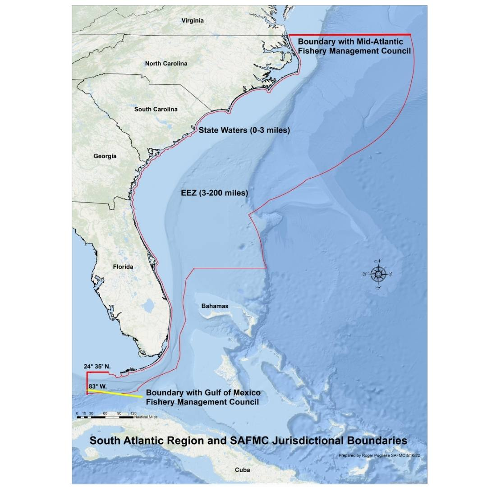
```

## Overview of Red Snapper Management
The Red Snapper fishery has separate management for the recreational and commercial sectors.

The regulations for the recreational fishery are set each year. If NOAA Fisheries determines that a season is allowed, the recreational season for the Red Snapper fishery opens the second Friday in July. The recreational sector season length varies based on previous years landings.  The recreational season in 2022 and 2023 was 2 days. The season was then closed until the following July. The recreational fishery is managed with a bag limit of one fish per day per angler.

The commercial fishery has a 75 lb gutted weight trip limit, and a commercial annual catch limit (ACL; 124,815 lbs whole weight in 2023). The commercial fishery opens the second Monday in July.  The commercial fishery remains open until the ACL is met.  In recent years (2022 and 2023), the commercial fishery has closed in August is closed until the following year.

The Red Snapper fishery currently does not have a size limit for the recreational or commercial sectors.  

The annual catch limit for the entire stock is split between the recreational (71.93%) and the commercial (28.07%) fleets. 

More information on the current management regulations for the Red Snapper fishery is available [here](https://safmc.net/species/snapper-red/).

## Overview of Gag Grouper Management

The Gag Grouper fishery has separate management for the recreational and commercial sectors.

The recreational fishery is closed to retention from the beginning of of January 1 through April 30 each year. Recreational fishers have a bag limit of 1 fish per person per day. 

The commercial fishery is closed to retention from the beginning of January 1 through April 30 each year. Commercial fishers have a trip limit of 1000 lbs (gutted weight). 

A minimum legal length of 24 inch (total length) in in place for both commercial and recreational fishers. 

The annual catch limit for the entire stock is split between the recreational (49%) and the commercial (51%) fleets. 

More information on the current management regulations for the Gag Grouper fishery is available [here](https://safmc.net/species/grouper-gag/).


# General Process for Generating Operating Models

This section describes the general process for generating operating models from SEDAR assessments.

The operating models (OMs) used in the MSE are age-structured, with an option for spatial structure, and age-based movement.

Single-stock operating models were first constructed from the SEDAR assessments. The single-stock OMs were then combined into a multi-stock OM that includes options for interactions between species and the fishing fleets exploiting these stocks.

The OMs currently have `r nsim` stochastic simulations and `r pyears` projection years.

Note that all biomass, catch, and size values within the MSE are in metric units of kilograms and millimeters. Any values can be converted to pounds and inches for presentation of final results.

The following sub-sections describe the process for generating the Red Snapper and Gag Grouper OMs from their respective SEDAR assessments. Operating models for other species can be added to the MSE framework by following this process.

## Process to Create Seasonal Fleet Structure
The recent assessments of Red Snapper and Gag Grouper were used to generate the operating models for these fisheries. The assessments were conducted with the [Beaufort Assessment Model (BAM)](https://repository.library.noaa.gov/view/noaa/4847). 
The assessments modelled the landings and discards for each fleet as two separate fleets: Landings and Discards. The Discards fleet includes both discards that occured during the fishing season, and discards that occur when the fishery was closed to retention (closed season).

To be able to evaluate management actions such as different season lengths, or minimum size limits, the operating model requires a different fleet structure to that used in the assessment.

The fleet structure for the operating model requires the removals to be split into On-Season (landings and discards that occur during the mini-seasons when the fishery is open) and Off-Season (discards of all catch when the fishery is closed). 

The general process for re-structuring the fleets is described in the steps below. The next section describes the implementation of this process for the Base Case models for the Red Snapper and Gag Grouper.

### Combine Landings and Discards into Total Removals**

Total fishing mortality ($F$) was calculated for each fleet and each year by summing the estimated fishing mortality from the landings and discards sub-fleets:

\begin{equation}
F_{\text{total},y}^f = F_{\text{landings},y}^f+ F_{\text{discards},y}^f
(\#eq:eq1)
\end{equation}

### Calculate proportion of Total Removals taken during On- and Off-Season**

Next, the reported fishery data (logbooks) were used to calculate the proportion of total removals (catch + discards) taken during the On- and Off-Seasons for each fleet and each year: 

\begin{equation}
C_{\text{total},y} = C_{\text{On},y}^f + C_{\text{Off},y}^f
(\#eq:eq4)
\end{equation}

\begin{equation}
\tilde{C}_{\text{On},y}^f = \frac{C_{\text{On},y}^f}{C_{\text{total},y}^f}
(\#eq:eq2)
\end{equation}

\begin{equation}
\tilde{C}_{\text{Off},y}^f = \frac{C_{\text{Off},y}^f}{C_{\text{total},y}^f}
(\#eq:eq3)
\end{equation}


where $C_\text{total}$ is the total reported removals by fleet $f$ in year $y$, $C_{\text{On}}$ is the reported catch taken when the fishery was open, $C_{\text{Off}}$ is the reported removals when fishery was closed, and $\tilde{C}_{\text{On}}$ and $\tilde{C}_{\text{Off}}$ are the fraction of catches taken during the On- and Off-Seasons respectively.

### Allocate proportion of total fishing mortality into On- and Off-Seasons**
Finally, the total fishing mortality for each fleet was divided into On- and Off-Seasons by multiplying $F_{\text{total},y}$ by the fraction of removals taken during the On- and Off-Seasons:

\begin{equation}
F_{\text{On},y}^f= \tilde{C}_{\text{On},y}^f F_{\text{total},y}^f
(\#eq:eq5)
\end{equation}

\begin{equation}
F_{\text{Off},y}^f= \tilde{C}_{\text{Off},y}^f F_{\text{total},y}^f
(\#eq:eq6)
\end{equation}

This results in an operating model with the fleets structured into On- and Off-Seasons components for each fleet.

## Red Snapper

The Red Snapper OM was based on the most recent stock assessment ([SEDAR 73](https://sedarweb.org/assessments/sedar-73/)). This assessment included six fleets:

1. Commercial Handline (cHL)
2. Commercial Handline - Discards (cHL.D)
2. Recreational Headboat (rHB)
2. Recreational Headboat - Discards (rHB.D)
3. General Recreational (rGN).
3. General Recreational - Discards (rGN.D).

Following the process described above, the operating model was developed with a different fleet structure.:

1. Commercial Handline - On-Season
2. Commercial Handline - Off-Season
2. Recreational Headboat - On-Season
2. Recreational Headboat - Off-Season
3. General Recreational - On-Season
3. General Recreational - Off-Season

The On- and Off-Season fleet structure was generated by calculating the proportion of total removals for each fleet that were taken during the open and closed seasons.

### Commercial Handline

The proportion of total removals taken during the open and closed seasons for the Commercial Handline fleet was calculated from the Commercial logbook data, filtered to only include records from the SAMFC region.

Information on the dates when the fishery was open and closed for the Commercial Handline fleet was obtained from Table 2.2.1 in the SEDAR 73 report. The first seasonal closure occurred in 2010, so the Off-Season Commercial Handline fleet had zero catches until 2010.

The values for discard mortality for the Commercial Handline fleet were taken from Table 6 in the SEDAR 73 report. The discard mortality was used to calculate the number of dead discards from the reported number of fish that were discarded alive in the logbooks.

The relative fishing mortality for the On- and Off-Seasons was calculated as the proportion of total removals that occurred during the open and closed seasons (Figure \@ref(fig:plotRSrelativeF)).

### Recreational Headboat

The proportion of total removals taken during the open and closed seasons for the Recreational Headboat fleet was calculated from the Headboat logbook data, filtered to only include records from the SAMFC region.

Information on the dates when the fishery was open and closed for the Recreational Headboat fleet was obtained from Table 2.2.2 in the SEDAR 73 report. The first seasonal closure occurred in 2010, so the Off-Season Headboat fleet had zero catches until 2010.

The values for discard mortality for the Recreational Headboat fleet were taken from Table 6 in SEDAR 73 report. The discard mortality was used to calculate the number of dead discards from the reported number of fish that were discarded alive in the logbooks.

The relative fishing mortality for the On- and Off-Seasons was calculated as the proportion of total removals that occurred during the open and closed seasons (Figure \@ref(fig:plotRSrelativeF)).

### General Recreational

The relative pattern in fishing mortality for the On- and Off-Season components of the General Recreational fleet was assumed to be the same as the Recreational Headboat fleet (Figure \@ref(fig:plotRSrelativeF)).

Further analyses of data from the Marine Recreational Information Program (MRIP) could be used to improve the estimates of total removals that occur during the open and closed seasons for the General Recreational fleet.

```{r plotRSrelativeF, fig.cap='The proportion of overall fishing mortality for the On-Season and Off-Season fleets for the Red Snapper fishery.', include=TRUE}
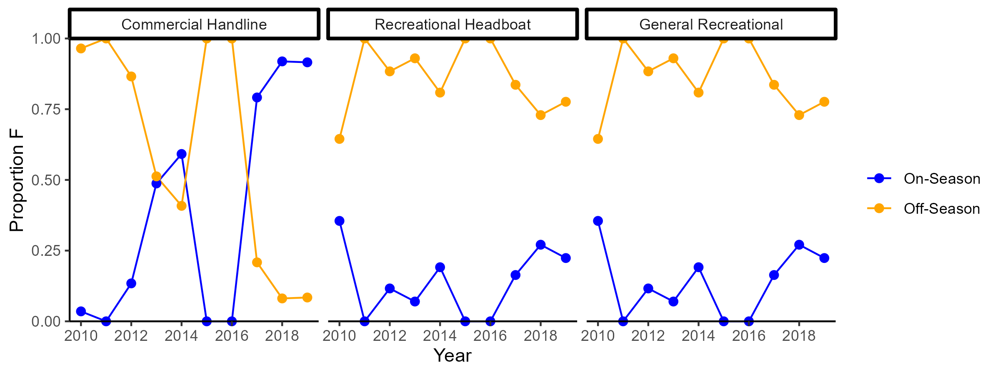
```

This results in an operating model with 6 fleets, with estimated landings and discards that occur during both the open and closed seasons for each fleet (Figure \@ref(fig:plotRSlandingsdiscards)). The selectivity pattern of the On-Season and Off-Season fleets was assumed to be the same.

```{r plotRSlandingsdiscards, fig.cap='The landings and discards for the On-Season and Off-Season fleets for the Red Snapper fishery.', include=TRUE}
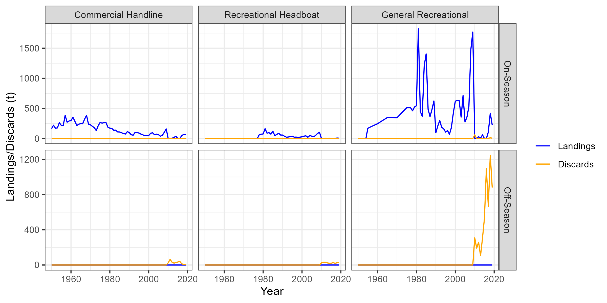
```

## Gag Grouper 

The gag OM was based on the most recent stock assessment ([SEDAR 71](https://sedarweb.org/assessments/sedar-71/)). This assessment included seven fleets:

1. Commercial Handline (cHL)
2. Commercial Handline - Discards (cHL.D)
2. Recreational Headboat (rHB)
2. Recreational Headboat - Discards (rHB.D)
3. General Recreational (rGN).
3. General Recreational - Discards (rGN.D).
2. Commercial Dive (cDV)

Similar to the Red Snapper model described above, the fleet structure of the operating model was modified to include the seasonal aspect of the fishery:

1. Commercial Handline - On-Season
2. Commercial Handline - Off-Season
2. Recreational Headboat - On-Season
2. Recreational Headboat - Off-Season
3. General Recreational - On-Season
3. General Recreational - Off-Season
4. Commercial Dive - On-Season

The Commercial Dive fleet does not have discards. As it is a targeted fishery, it does not operate during the closed seasons and therefore is only modeled as an On-Season fleet

The SEDAR 71 model was converted to the OM with the On- and Off-Season structure following the same approach used for the Red Snapper described above.

The landings- and discard-at-age from the SEDAR 73 model for the three fleets (cHL, rHB, and rGN) were combined into total removals. This results in a model that describe the total removals-at-age by year for the three fleets. The On- and Off-Season fleet structure was then generated by calculating the proportion of total removals that were taken during the open and closed seasons.

### Commercial Handline

The proportion of total removals taken during the open and closed seasons for the Commercial Handline fleet was calculated from the Commercial logbook data, filtered to only include records from the SAMFC region.

Information on the dates when the fishery was open and closed for the Commercial Handline fleet was obtained from Table 2.7.1 in the SEDAR 71 report. The first closure occurred in 1999, so the Off-Season Commercial Handline fleet had zero catches until 1999.

Following the assessment, discard mortality was assumed to be 0.4 for the Commercial Handline fleet and 0.25 for the Recreational Headboat and the General Recreational fleets. The discard mortality was used to calculate the number of dead discards from the reported number of fish that were discarded alive in the logbooks.

The relative fishing mortality for the On- and Off-Seasons was calculated as the proportion of total removals that occurred during the open and closed seasons (Figure \@ref(fig:plotGGrelativeF)).

### Recreational Headboat

The proportion of total removals taken during the open and closed seasons for the Recreational Headboat fleet was calculated from the Headboat logbook data, filtered to only include records from the SAMFC region.

Information on the dates when the fishery was open and closed for the Recreational Headboat fleet was obtained from Table 2.7.2 in the SEDAR 71 report. The first seasonal closure occurred in 2010, so the Off-Season Headboat fleet had zero catches until 2010.

The relative fishing mortality for the On- and Off-Seasons was calculated as the proportion of total removals that occurred during the open and closed seasons (Figure \@ref(fig:plotGGrelativeF)).

### General Recreational

Following the approach used for Red Snapper, the relative pattern in fishing mortality for the On- and Off-Season components of the General Recreational fleet was assumed to be the same as the Recreational Headboat fleet (Figure \@ref(fig:plotGGrelativeF)).

```{r plotGGrelativeF, fig.cap='The proportion of overall fishing mortality for the On-Season and Off-Season fleets for the Gag Grouper fishery.', include=TRUE}
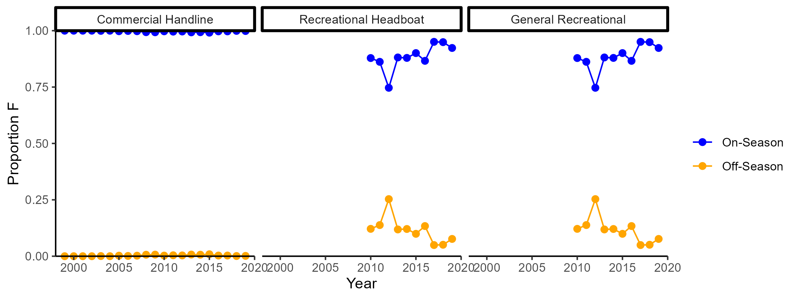
```

The operating model was constructed by allocating, for each fleet, the total fishing mortality (removals) in each year between On- and Off-Season components of the fleet according to the pattern in relative F described above.

As it is a targeted fishery, the Commercial Dive fleet only operates in the On-Season. This results in an operating model with 7 fleets, with estimated landings and discards that occur during both the open and closed seasons for each fleet (Figure \@ref(fig:plotGGlandingsdiscards)).


```{r plotGGlandingsdiscards, fig.cap='The landings and discards for the On-Season and Off-Season fleets for the Gag Grouper fishery.', include=TRUE}
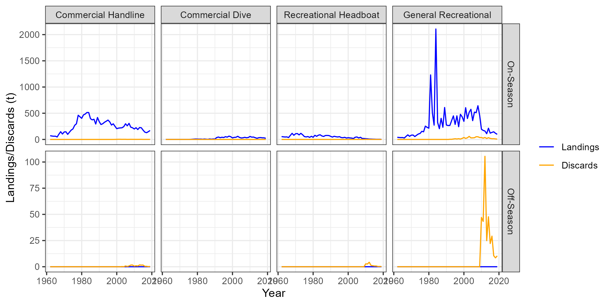
```

## Generating Multi-Species Operating Model

A multi-species operating model was generated by combining the Red Snapper and Gag Grouper OMs together. The fishery dynamics for each stock within the multi-species operating model must have the same structure: i.e., same number of historical years, and the same fleet structure.

The initial year of the Gag Grouper assessment is 1962, 12 years later than the initial year for Red Snapper (1950). To match the initial year of the Red Snapper OM, the Gag model was extended back for 12 years, with no fishing mortality for any of the fleets.

To maintain the same fleet structure, the Commercial Dive fleet was added to the Red Snapper model, but fishing mortality set to 0 for all years.


# Base Case Operating Model

The Base Case operating model for Red Snapper and Gag fisheries was based directly on the respective SEDAR assessments for each species, following the process described above. This section summarizes the main properties of the Base Case OM.

Alternative operating models are developed as modifications of the Base Case OM. These alternative operating models are intended to span the critical uncertainties in the knowledge of the fishery systems, and are described in Section \@ref(altoms).

## Selectivity and Retention Schedules

Figures \@ref(fig:RSselect) and \@ref(fig:GGselect) show the selectivity- and retention-at-age curves in the last historical year (2019) for the On- and Off-Season fleets for the Red Snapper and Gag Grouper respectively. The selectivity pattern of the On-Season and Off-Season fleets is assumed to be the same.

The selectivity and retention curves remain the same in the projection period unless changed by a management procedure. Retention curves with a maximum value less than one indicate a general level of discarding.

```{r RSselect, fig.cap='The selectivity- (solid line) and retention-at-age (dashed line) curves for the Red Snapper in the multi-species operating model. The plot shows the curves from the last historical year (2019).', include=TRUE}
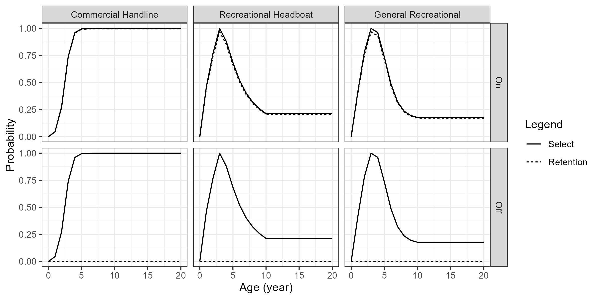
```

```{r GGselect, fig.cap='The selectivity- (solid line) and retention-at-age (dashed line) curves for the Gag Grouper in the multi-species operating model. The plot shows the curves from the last historical year (2019).', include=TRUE}
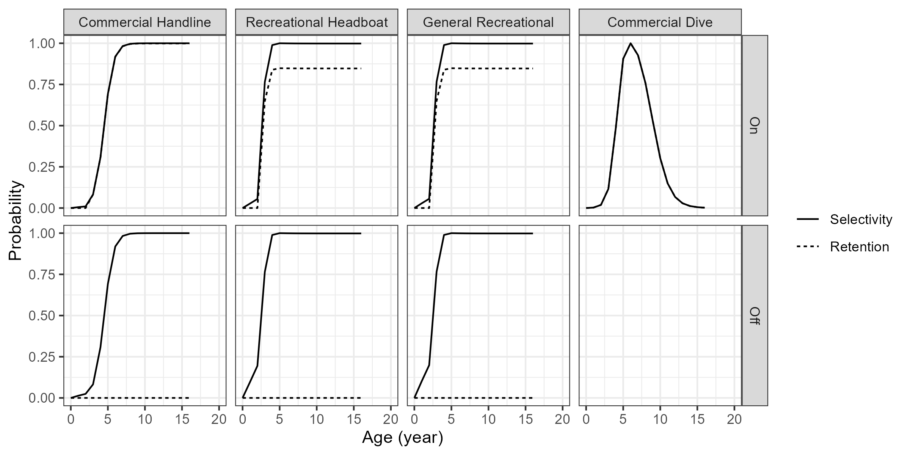
```

## Removals, Landings, and Discards

 Figures \@ref(fig:plotRSGGRemovalshist),  \@ref(fig:plotRSGGLandingshist), and  \@ref(fig:plotRSGGDiscardshist) show historical overall removals, and landings and discards by fleet respectively for the Red Snapper and Gag Grouper multi-species Base Case operating model.

```{r plotRSGGRemovalshist, fig.cap='The overall removals (1,000 t) from the historical period of the Red Snapper and Gag Grouper multi-species operating model.', include=TRUE, out.width = "600px"}
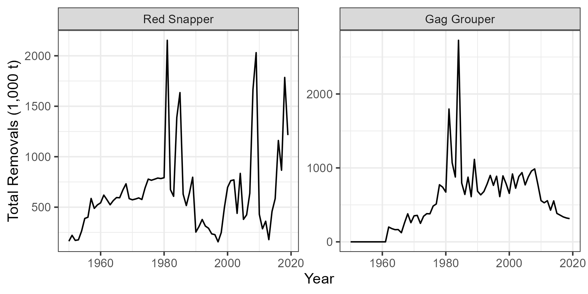
```

```{r plotRSGGLandingshist, fig.cap='The landings (1,000 t) by fleet from the historical period of the Red Snapper and Gag Grouper multi-species operating model. Note the different scale on the y-axes.', include=TRUE, out.width = "600px"}
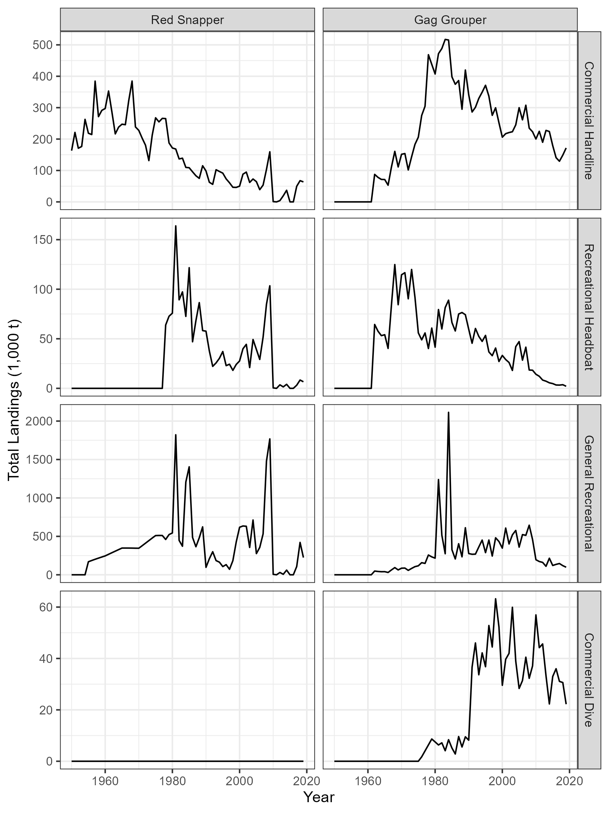
```

```{r plotRSGGDiscardshist, fig.cap='The discards (1,000 t) by fleet from the historical period of the Red Snapper and Gag Grouper multi-species operating model. Note the different scale on the y-axes.', include=TRUE, out.width = "600px"}
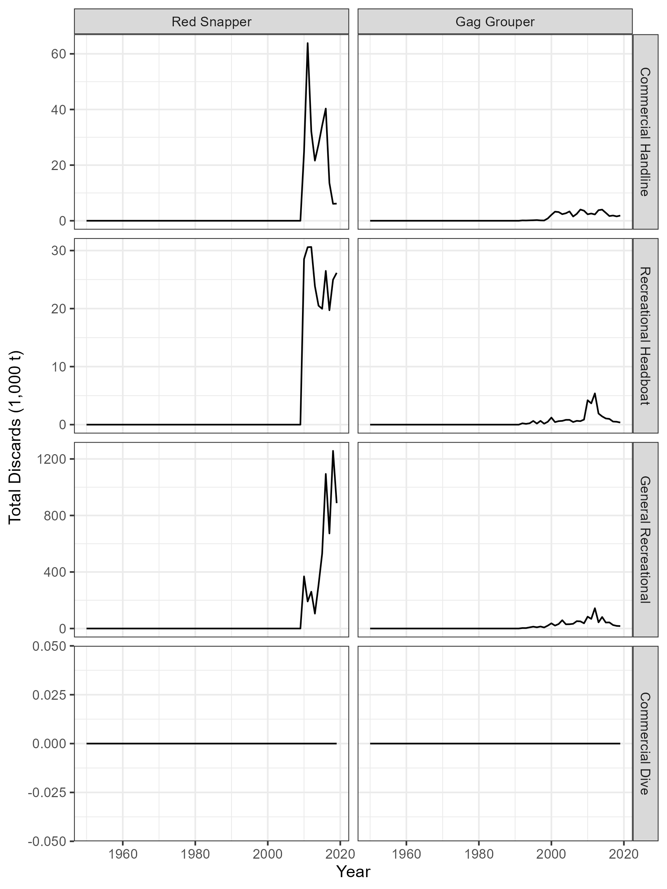
```


## Calculation of Reference Points

The reference points are calculated following the same method described in the SEDAR reports. This section describes the calculation of reference points for the Red Snapper and Gag Grouper. The calculation for other species added to the MSE analysis will follow a similar process.

### Red Snapper

The maximum fishing mortality threshold (MFMT) for Red Snapper is defined by the SAMFC as $F_{30\%}$, and the minimum stock size threshold (MSST) as $75\%\text{SSB}_{F30\%}$. Overfishing is defined as F > MFMT and overfished as SSB < MSST, with $\text{SSB}_{F30\%}$ defined as the rebuilding target.

```{r RS_refpoints}
RS_Ref_df <- readRDS('../Hist_Objects/RS_basecase_ref_points.rda')
```

The relationship between fishing mortality and the spawning potential ratio (SPR) was calculated using the selectivity curve representing total removals in the terminal historical year (2019; Figure \@ref(fig:plotRSrefpoints)). This resulted in a $F_{30\%}$ = `r RS_Ref_df$F`, and MSST of `r round(RS_Ref_df$MSST,0)` (eggs 1E8; Figure \@ref(fig:plotRSrefpoints)).

It should be noted that the calculation of $F_{30\%}$ and associated metrics is a function of the overall selectivity curve for the fishery, and the values will be different if the overall selectivity pattern in the future (for example, introduction of size limits, or changes in relative exploitation levels of the different fleets).

```{r plotRSrefpoints, fig.cap='The relationship between a) fishing mortality (F) and equilibrium spawning biomass (SB) and b) spawning potential ratio (SPR) for Red Snapper. The maximum fishing mortality threshold (MFMT) is indicated with the vertical dashed line. The equilbrium SB and SPR corresponding with MFMT are indicated with horizontal dashed lines. The horizontal dotted line indicates the minimum stock size threshold (MSST), defined as 75% of SB~MFMT~.', include=TRUE}
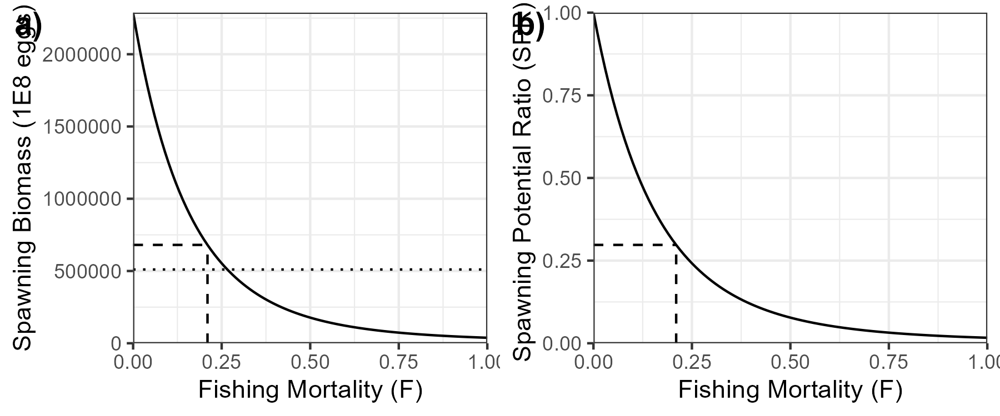
```

### Gag Grouper

The maximum fishing mortality threshold (MFMT) for Gag Grouper is defined by the SAMFC as $F_{\text{MSY}}$, and the minimum stock size threshold (MSST) as $75\%\text{SSB}_{\text{MSY}}$. Overfishing is defined as F > MFMT and overfished as SSB < MSST.

```{r GG_refpoints}
GG_Ref_df <- readRDS('../Hist_Objects/GG_basecase_ref_points.rda')
```

$F_{\text{MSY}}$ was calculated using the selectivity curve representing total removals in the terminal historical year (2019; Figure \@ref(fig:plotGGrefpoints)). This resulted in a $F_{\text{MSY}}$ = `r GG_Ref_df$F`, and MSST of `r round(GG_Ref_df$MSST,0)` (Figure \@ref(fig:plotRSrefpoints)).

It should be noted that the calculation of $F_{\text{MSY}}$ and associated metrics is a function of the overall selectivity curve for the fishery, and the values will be different if the overall selectivity pattern in the future (for example, introduction of size limits, or changes in relative exploitation levels of the different fleets).

```{r plotGGrefpoints, fig.cap='The relationship between a) fishing mortality (F) and equilibrium removals (metric tons) and b) spawning stock biomass (mt) for Gag Grouper. The maximum fishing mortality threshold (MFMT) is indicated with the vertical dashed line. The equilbrium spawning biomass corresponding with MFMT is indicated with the horizontal dashed line. The horizontal dotted line indicates the minimum stock size threshold (MSST), defined as 75% of SB~MFMT~.', include=TRUE}
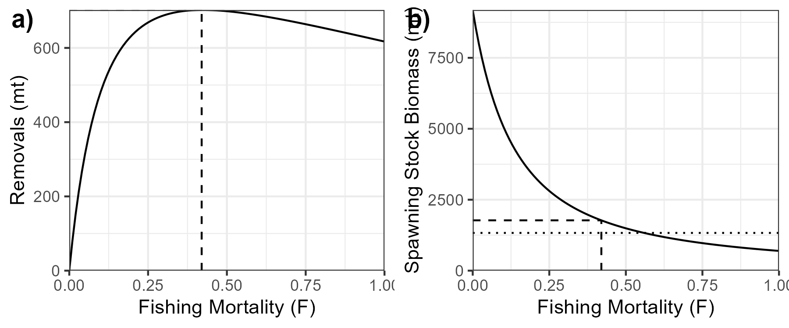
```
  
## Biomass and Reference Points

Figures \@ref(fig:plotRSSBref) and \@ref(fig:plotGGSBref) show the predicted spawning biomass and the corresponding reference points for the Red Snapper and Gag Grouper stocks in the Base Case multi-stock operating model. Both stocks are below the MSST reference point in the terminal year (2019). Red Snapper appears to be rebuilding towards MSST, while the trend for Gag Grouper is a continuing decline.

```{r plotRSSBref, fig.cap='The spawning stock (eggs) for Red Snapper from the Base Case OM. The horizontal lines indicate the reference points (see Reference Point section above).', include=TRUE, out.width = "600px"}
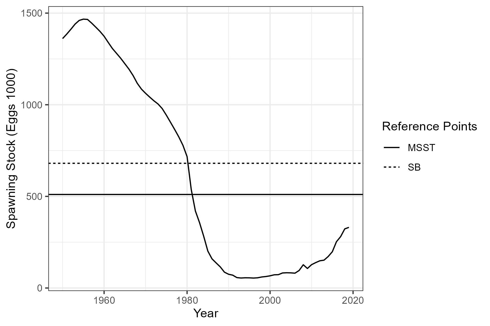
```

```{r plotGGSBref, fig.cap='The spawning stock (1000 t) for Gag Grouper from the Base Case OM. The horizontal lines indicate the reference points (see Reference Point section above).', include=TRUE, out.width = "600px"}
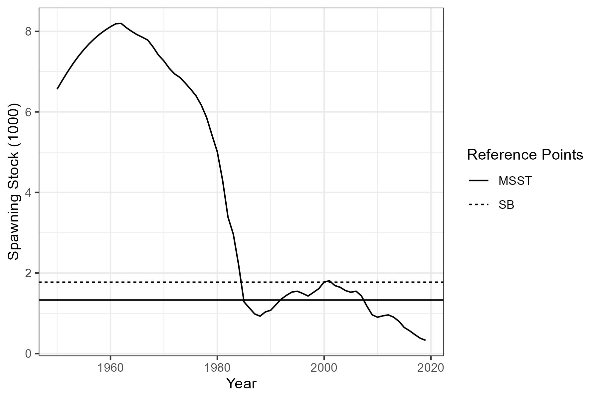
```


# Spatial Structure, Distribution, and Movement

The SEDAR assessments do not include spatial structure. Consequently, information on the spatial distribution and movement of the stocks has to be obtained from elsewhere, and the spatial structure added into the operating model developed from the SEDAR assessments.

There are three pieces of information required for including spatial structure in an MSE:

1. The spatial structure of the model, specifically the relative size of each area
2. The relative distribution of unfished abundance for each species in each area
3. The probability of fish from each species moving from one area to another in each year

## Definition of Spatial Structure 

The spatial structure of the MSE has been defined as 6 areas, including 3 geographic regions (Figure \@ref(fig:spatialareas)) and a Nearshore (<100ft) and Offshore (>100ft) component for each region (black line in Figure \@ref(fig:spatialareas)).

The relative size of each area was determined by first calculating the surface area of the entire area included in the MSE (all colored regions in Figure \@ref(fig:spatialareas)), and then calculating the proportion of the total area that was within the Nearshore and Offshore region of each geographic area (Table \@ref(tab:areasize)). 

> Note: this calcutation assumes that suitable potential habitat is equally distributed across the entire region.

```{r spatialareas, fig.cap='The six spatial areas defined in the MSE, with three geographic regions (colors) and a division of each in Nearshore (<100ft) and Offshore (>100ft) (black line).', include=TRUE}
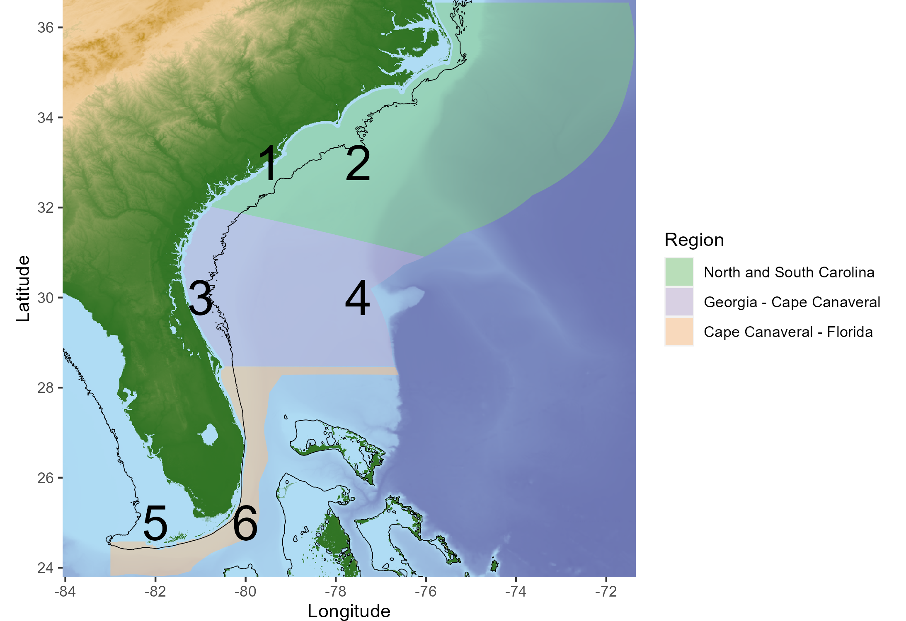
```

```{r areasize, include=TRUE} 
dat <- readRDS('../data_spatial/areas_df.rds') %>%
  mutate('Relative Size'=round(Relative.Size,3)*100) %>%
  select(-Relative.Size)
knitr::kable(dat, caption='The relative size (%) of the six areas defined for the SAFMC MSE.')
```

## Latitudinal Distribution of Unfished Abundance  

Information on the unfished distribution of Red Snapper and Gag is not available. Instead, the assumed unfished distribution was derived from various sources of information, including the South-East Reef Fish Survey (SERFS) [@bubley2023] and studies reported in the literature.

It may also be possible to use other data, such as CPUE information from MRIP and headboat surveys or a deepwater longline survey, to calculate improved estimate of the relative abundance of Red Snapper and Gag Grouper across the three regions.

**Red Snapper**

Data from SERFS [@bubley2023] was used to calculate the average relative abundance from 1990 -- 2022 of Red Snapper and Gag in each of the three geographic areas included in the MSE. 

This analysis reports that the highest abundance of Red Snapper is in the Georgia - Cape Canaveral region, and the abundance in North and South Carolina is about 1/4 of that in the Georgia - Cape Canaveral region. The data from the survey suggests that the relative abundance in the Cape Canaveral - Florida region is about 7% of that in the Georgia - Cape Canaveral region. 

However, the SERFS survey did not include the entire Florida region included in the SAFMC management area, but stopped at the St. Lucie Inlet, FL. Consequently, the SERFS data may significantly under-estimate the relative average abundance of Red Snapper in the Florida region included in the MSE. 

The most recent assessment of Red Snapper from the Gulf of Mexico ([SEDAR 52](https://sedarweb.org/documents/sedar-52-gulf-of-mexico-red-snapper-final-stock-assessment-report/)) estimates an unfished biomass in the east of the GoM about 6 times higher than the unfished biomass estimated for Red Snapper in the SAMFC region ([SEDAR 73](https://sedarweb.org/documents/sedar-73-stock-assessment-report-south-atlantic-red-snapper/)). This suggests that the abundance of Red Snapper is considerably higher in the Gulf of Mexico, and indicates a pattern of decreasing abundance of Red Snapper with increasing latitude, a result supported by the SERFS survey [@bubley2023].

Based on this information, the Base Case OM currently assumes that the unfished abundance of Red Snapper in the Cape Canaveral - Florida region is twice as high as that in the Georgia - Cape Canaveral region (Table \@ref(tab:BCdist)). 

Alternative operating models can be developed to evaluate the sensitivity of the results to this assumption.

**Gag**

The analysis of the SERFS [@bubley2023] data reveals that the abundance of Gag in the North and South Carolina region is about 2.5 times higher than that in the Georgia - Cape Canaveral region, and the lowest abundance south of Cape Canaveral. This suggests a pattern of increasing abundance of Gag with increasing latitude. This is supported by the study of @gruss2017, who report that Gag are most common in the north-east region of the Gulf of Mexico compared to regions further south. 

Given this information, and the fact that the SERFS survey likely under-estimates the abundance of Gag in the Cape Canaveral - Florida region, the Base Case OM assumes that the unfished abundance in the  Cape Canaveral - Florida region is half of that in the Georgia - Cape Canaveral region (Table \@ref(tab:BCdist)). 

Alternative operating models can be developed to evaluate the sensitivity of the results to this assumption.

```{r BCdist, include=TRUE} 
dat <- readRDS('../Build_Package/Objects/BaseCase/Spatial_Regional_Dist.rds') 
dat <- dat %>% tidyr::pivot_wider(., names_from ='Stock', values_from=Frac_Area)
knitr::kable(dat, caption='The assumed relative unfished abundance of Red Snapper and Gag in the three geographic regions.')
```

## Age-Specific Distribution by Depth Zone

The relative geographic distribution of each species is combined with information about the relative distribution by depth (Nearshore and Offshore) of each age-class to calculate the overall distribution across the 6 areas (Figure \@ref(fig:spatialareas)).  

**Red Snapper**

@mitchell2014 used data from two fishery-independent surveys in the southeastern US Atlantic Ocean to calculate the depth distribution of Red Snapper. They found that most recruitment occurred in the shallow nearshore waters, but after about 3 years (> 50 cm FL) there was no detectable difference in the depth-distribution of Red Snapper by age or length. 

Following the results reported in @mitchell2014, the Base Case OM assumes that almost all age-0 fish (recruits) are located in the Nearshore region, with a decline in the fraction in the Nearshore region from 95% at age-0 to 50% at age-4. All fish older than age-4 are assumed to be equally distributed between Nearshore and Offshore regions (Figure \@ref(fig:basecasedist)).

**Gag** 

The age-specific depth distribution of Gag was based on the analysis of @carruthers2015, who used a spatial populations dynamics model to estimate the fraction of unfished individuals by age-class in the nearshore and offshore regions of the Gulf of Mexico. They found that juvenile Gag are most likely to be in the nearshore region, but move offshore as they increase in age (Fig 8 in @carruthers2015).

Based on this analysis, the Base Case OM assumed the age-specific unfished distribution of Gag in the SAMFC management area is similar to that in the Gulf of Mexico  (Figure \@ref(fig:basecasedist)). 

```{r basecasedist, fig.cap='The assumed unfished distribution by age, depth, and geographic region for the Red Snapper and Gag Base Case operating model.', include=TRUE}
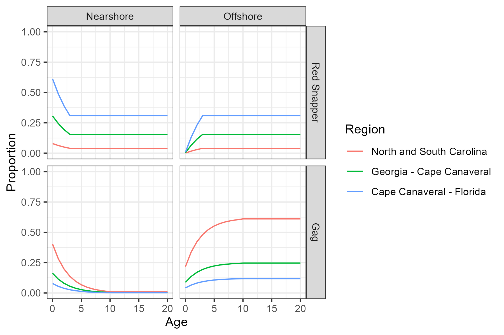
```

## Probability of Movement 

The final piece of information required for adding spatial structure to the MSE is a prior on the the probability of fish remaining in an area in any given year, and for those that move, the relative probability of moving to the each of the other areas.

Given the relatively high spatial structure of the Red Snapper and Gag, particularly the latitudinal gradient in abundance, and the reported site fidelity of Red Snapper [@topping2011], the Base Case OM assumed a prior probability of 0.95 that fish remain within an area in a given year. 

Of those that move, the OM assumed that the probability of moving to a geographically distant area (e.g., Area 1 to Area 5, or vice versa) was 100 times less than the probability of moving to a closer area (e.g., Area 1 to Area 2).

## Calculating Movement Matrix 

A movement matrix is calculated within the MSE framework using the specified information on the assumed age-specific unfished distribution by area and depth, and the probability of moving to any given area. This model uses the specified relative probability of moving to each area, and optimizes the probability of remaining in a given area to solve for the specified relative distribution by area. See `?makemov2` in the `MSEtool` R package for more information on this method.

# Assumptions for Projection Dynamics

## Recruitment Process Error

```{r recdevs}
base_case_process_error <- readRDS('../Hist_Objects/Base_Case_Process_Error.rda')
RS_rec_devs <- base_case_process_error %>% filter(Stock=='Red Snapper')
GG_rec_devs <- base_case_process_error %>% filter(Stock=='Gag Grouper')
```

The variance-covariance matrix was estimated from the historical log recruitment deviations of each species in the analysis. A truncated multivariate normal distribution, truncated at 2 standard deviations, was then used to generate correlated random log recruitment deviations for the projection period, with the standard deviation and lag-1 auto-correlation factor reported by the stock assessments (Figure \@ref(fig:RS-rec-dev-stats)).

```{r RS-rec-dev-stats, fig.cap='Distribution of the log recruitment deviations for a) Red Snapper and b) Gag Grouper, with a fitted normal distribution shown in blue. Panels c) and d) show the deviations in normal space, and include the log-normal distribution used to generate recruitment process error for the projection period.', include=TRUE}
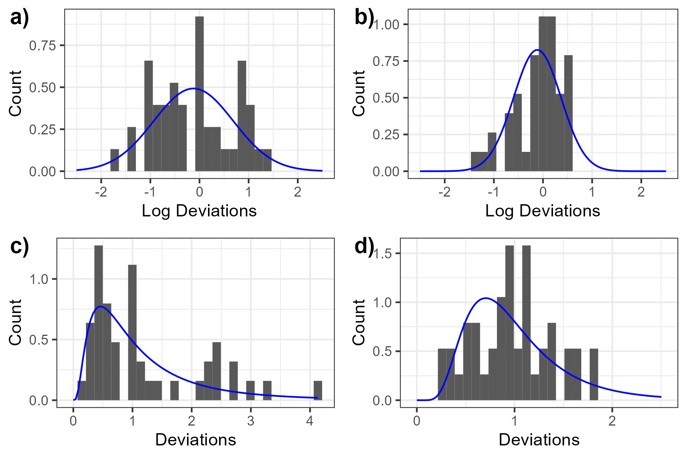
```

For the Base Case OM, the standard deviation of the log recruitment deviations for Red Snapper was `r round(RS_rec_devs$SD,2)` with an auto-correlation factor of `r round(RS_rec_devs$AC,2)`. Figure \@ref(fig:RS-rec-devs) shows an example of the recruitment deviations for 9 simulations for Red Snapper.

```{r RS-rec-devs, fig.cap='An example of the recruitment deviations from 9 simulations from the Red Snapper stock in the Base Case OM. The black lines indicates the recruitment deviations during the historical period (identical across all simulations). The blue line indicates the recruitment deviations in the projection period, which were generated from a distribution with the statistical properties (standard deviation and auto-correlation) reported by SEDAR 73.', include=TRUE}
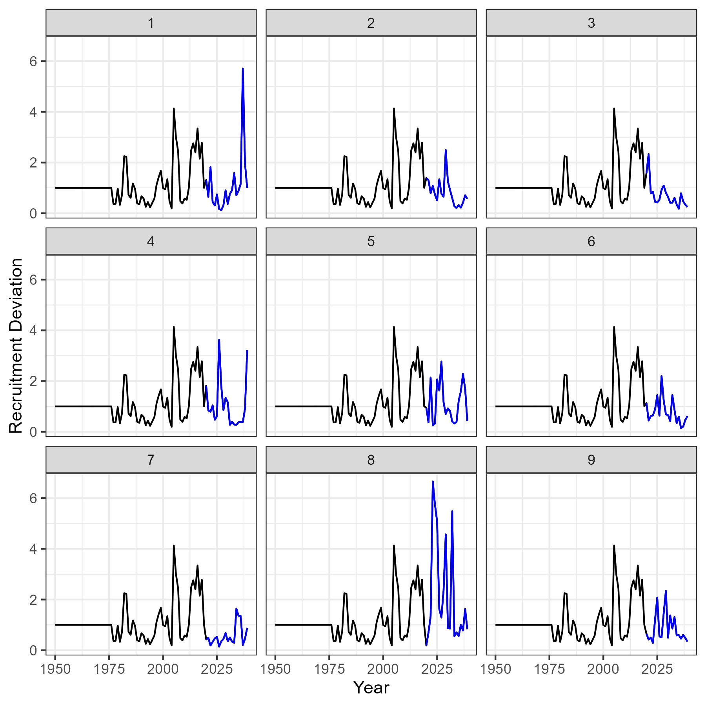
```

For the Base Case OM, the standard deviation of the log recruitment deviations for Gag Grouper was `r round(GG_rec_devs$SD,2)` with an auto-correlation factor of `r round(GG_rec_devs$AC,2)`.  Figure \@ref(fig:GG-rec-devs) shows an example of the recruitment deviations for 9 simulations for Gag Grouper.

```{r GG-rec-devs, fig.cap='An example of the recruitment deviations from 9 simulations from the Gag Grouper stock in the Base Case OM. The black lines indicates the recruitment deviations during the historical period (identical across all simulations). The blue line indicates the recruitment deviations in the projection period, which were generated from a distribution with the statistical properties (standard deviation and auto-correlation) reported by SEDAR 71', include=TRUE}
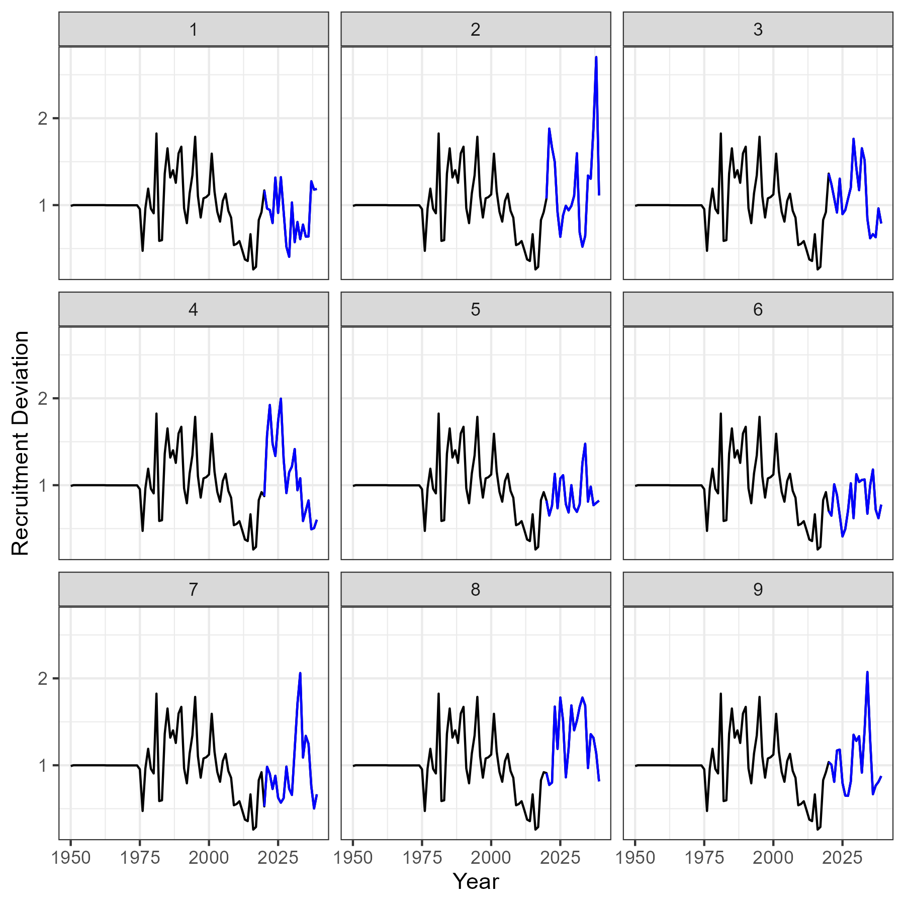
```

## Life-History

In the Base Case OM, the life-history parameters in the projections are assumed to be stationary; i.e., remain at the same values as the terminal historical year.

## Selectivity

The selectivity pattern of each fleet in the projection period is assumed to remain unchanged from the terminal historical year, unless the selectivity or retention curve is modified by a management procedure.

## Implementation Error

The Base Case OM does not assume any implementation error.

Any error in the implementation of management regulations set by the Management Procedures is set within the MPs.

## Observation Error

Currently the Base Case OM assumes no observation error on the simulated data. This assumption will be revised when management procedures that use specific data to set management advice are developed.


# Alternative Operating Models {#altoms}

The alternative operating models are developed as variations of the Base Case OM, and are intended to span the key uncertainties in the understanding of the fishery system.

The uncertainties considered in the alternative operating models have been identified from the most consequential sensitivity tests in the Red Snapper  ([SEDAR 73](https://sedarweb.org/assessments/sedar-73/)) and Gag stock assessments ([SEDAR 71](https://sedarweb.org/assessments/sedar-71/)), and from discussions with the Snapper-Grouper Advisory Panel.

```{r}
OMdat <- read.csv('../OM_details/OM_descriptions.csv')
```

Currently `r nrow(OMdat)` operating models (including the Base Case) have been developed. Table \@ref(tab:omdesc) provides a summary of the operating models. The sub-sections below describe more details for each of the alternative operating models. 

```{r omdesc, include=TRUE} 

knitr::kable(OMdat, caption='Summary of the operating models developed for the MSE.')
```


## Natural Mortality: OM_02 & OM_03

The sensitivity tests in the Red Snapper and Gag assessments revealed that the results were most sensitive to the assumed values for the age-specific natural mortality (*M*). 

Two operating models were developed to span the lower and upper bounds of *M* considered in the sensitivity tests of the two assessments. 

In `OM_02`, the Lorenzen curve describing M-at-age was scaled to the lower values from the sensitivity tests: M = 0.07 and M = 0.10 for Red Snapper and Gag respectively.

In `OM_03`, the Lorenzen curve describing M-at-age was scaled to the higher values from the sensitivity tests: M = 0.15 and M = 0.25 for Red Snapper and Gag respectively.

The *M* for adult Red Snapper and Gag in the Base Case OM is 0.11 and 0.17 respectively.

## Changes in Future Productivity: OM_04, OM_05, and OM_06 

Three operating models were developed to consider changes in productivity in the future, such as those caused by changes to climate and oceanographic conditions in the future, or by increased coastal development.

In `OM_04` a cyclic recruitment pattern is superimposed over the log-normally distributed recruitment process error included in the Base Case OM.

In `OM_05` recruitment is randomly reduced to very low levels in some years, to represent an unexpected recruitment failure caused by loss of nursery habitat or adverse climate conditions. The declines in recruitment are correlated across the stocks in the MSE.

In `OM_06` the mean length-at-age, weight-at-age, and corresponding maturity-at-age schedules are modified to represent a gradual decline in growth over the projection years. 

## Uncertainties in Data: OM_07

`OM_07` considers uncertainty in the relative landings of the commercial and for-hire vessels relative to the recreational fleet. There is some evidence to suggest that the recreational catch has been over-estimated. This uncertainty is considered by re-running the assessment models with the recreational landings reduced by 40%. 

## Uncertainties in Future Fleet Dynamics: OM_08

`OM_08` considers  an average increase of 2% per year in fishing effort for the recreational fleet in the projection years, due to either technology creep or existing latent effort. 

## Uncertainties in Spatial Dynamics: OM_9 & OM_10

`OM_09` and `OM_10` consider alternative scenarios for the assumed proportion of the unfished stock that is in the Cape Canaveral -- Florida region of the MSE. 

`OM_09` assumes a lower value for the assumed fraction in the southernmost region.

`OM_10` assumes a higher value for the assumed fraction in the southernmost region.


# Management Procedures

<!--
- status quo

- size limits
- slot limits
- effort control

- increased use of descending devices 

- bag limits - requires data:

-->

## Fleet-Specific Fishing Mortality or Removals

A generic function `Fleet_MMP` is used to set the fishing mortality or catch (total removals) for each fleet. `Fleet_MMP` is used inside wrapper functions that define the specific management recommendations for each simulation and year (see below for examples).

The `Fleet_MMP` function has two standard arguments for `MMP` (multi-stock/fleet management procedures) `x`: simulation number, and `DataList`: a list of `Data` objects, and a third argument `Fleet_Management`.

`Fleet_Management` is a data frame that specifies the management in terms of catch, fishing mortality (F), and/or a minimum legal length (MLL), for each stock and fleet:
  
```{r, include=TRUE}
Fleet_Management
```

Either F or Catch must be set for each stock-fleet (but not both for same stock-fleet). The minimum legal length (mm) is assumed to be implemented as a knife-edge retention curve, and only applies to the On-Season fleets. If `MLL` is NA, the retention curve is unchanged.

Note that the specified Catch refers to the total removals (landings + dead discards).


The following sub-sections include some simple examples of management procedures that set management in terms of F, catch, and/or a minimum legal length for each stock and fleet.

### Status Quo

This management procedure sets the fishing mortality for each fleet to the mean F from the 3 last historical years (2017 -- 2019):
  
```{r, echo=TRUE, include=TRUE}
StatusQuo <- function(x, DataList, ...) {

  stocks <- unique(Fleet_Management$Stock)
  fleets <- unique(Fleet_Management$Fleet)
  nstocks <- length(stocks)
  nfleets <- length(fleets)

  # copy the internal `Fleet_Management` object
  this_Fleet_Management <- Fleet_Management

  # loop over stocks and fleets
  for (s in 1:nstocks) {
    for (f in 1:nfleets) {
      # calculate mean F from 3 last historical years
      meanF <- mean(DataList[[s]][[f]]@Misc$FleetPars$Fishing_Mortality[x,68:70])
      # populate the `F` value in `this_Fleet_Management` object
      this_Fleet_Management <- this_Fleet_Management %>%
        dplyr::mutate(F=replace(F, Stock==stocks[s] &Fleet==fleets[f], meanF))
    }
  }
  # call internal `Fleet_MMP` function with `this_Fleet_Management` object
  Fleet_MMP(x, DataList, Fleet_Management=this_Fleet_Management)
}
# define as class `MMP`
class(StatusQuo) <- 'MMP'
```

### Fixed F with a Minimum Legal Length Limit

This management procedure sets the fishing mortality for each fleet to the mean F from the 3 last historical years (2017 -- 2019) (same as above) and includes a minimum legal length for the Red Snapper and Gag Grouper:
  
```{r, echo=TRUE, include=TRUE}
StatusQuo_MLL <- function(x, DataList, ...) {

  stocks <- unique(Fleet_Management$Stock)
  fleets <- unique(Fleet_Management$Fleet)
  nstocks <- length(stocks)
  nfleets <- length(fleets)

  # copy the internal `Fleet_Management` object
  this_Fleet_Management <- Fleet_Management

  # loop over stocks and fleets
  for (s in 1:nstocks) {
    for (f in 1:nfleets) {
      # calculate mean F from 3 last historical years
      meanF <- mean(DataList[[s]][[f]]@Misc$FleetPars$Fishing_Mortality[x,68:70])
      # populate the `F` value in `this_Fleet_Management` object
      this_Fleet_Management <- this_Fleet_Management %>%
        dplyr::mutate(F=replace(F, Stock==stocks[s] &Fleet==fleets[f], meanF))
    }
  }

  # Set MLL
  MLL_RS <- inch2mm(20) # 20 inch MLL
  this_Fleet_Management <- this_Fleet_Management %>%
    dplyr::mutate(MLL=replace(MLL, Stock=='Red Snapper', MLL_RS))

  MLL_GG <- inch2mm(25) # 25 inch MLL
  this_Fleet_Management <- this_Fleet_Management %>%
    dplyr::mutate(MLL=replace(MLL, Stock=='Gag Grouper', MLL_GG))

  # call internal `Fleet_MMP` function with `this_Fleet_Management` object
  Fleet_MMP(x, DataList, this_Fleet_Management)
}
# define as class `MMP`
class(StatusQuo_MLL) <- 'MMP'
```

### Fixed F at MFMT

This management procedure sets F for each stock to the maximum fishing mortality rate (MFMT), while maintaining the same relative F for each fleet:

```{r, echo=TRUE, include=TRUE}
Ftarget <- function(x, DataList, ...) {

  MFMT <- data.frame(Stock=c('Red Snapper', 'Gag Grouper'),
                     MFMT=c(0.21, 0.42))

  stocks <- unique(Fleet_Management$Stock)
  fleets <- unique(Fleet_Management$Fleet)
  nstocks <- length(stocks)
  nfleets <- length(fleets)

  # copy the internal `Fleet_Management` object
  this_Fleet_Management <- Fleet_Management

  # loop over stocks and fleets
  for (s in 1:nstocks) {
    for (f in 1:nfleets) {
      # calculate mean F from 3 last historical years
      meanF <- mean(DataList[[s]][[f]]@Misc$FleetPars$Fishing_Mortality[x,68:70])

      # populate the `F` value in `this_Fleet_Management` object
      this_Fleet_Management <- this_Fleet_Management %>%
        dplyr::mutate(F=replace(F, Stock==stocks[s] &Fleet==fleets[f], meanF))
    }
  }

  # Calculate relative F for each fleet (by Stock)
  this_Fleet_Management <- this_Fleet_Management %>% group_by(Stock) %>% mutate(Frat=F/sum(F))


  # Set overall F to MFMT for each stock
  this_Fleet_Management <- left_join(this_Fleet_Management, MFMT, by='Stock')
  this_Fleet_Management <- this_Fleet_Management %>% mutate(F=MFMT*Frat)


  # call internal `Fleet_MMP` function with `this_Fleet_Management` object
  Fleet_MMP(x, DataList, this_Fleet_Management)
}
# define as class `MMP`
class(Ftarget) <- 'MMP'
```

### Fixed Catch

This management procedure sets the removals for each fleet to the mean removals from the 3 last historical years (2017 -- 2019):
  
```{r, echo=TRUE, include=TRUE}
fixedC_mean3 <- function(x, DataList, ...) {
  
  stocks <- unique(Fleet_Management$Stock)
  fleets <- unique(Fleet_Management$Fleet)
  nstocks <- length(stocks)
  nfleets <- length(fleets)
  
  this_Fleet_Management <- Fleet_Management
  nyears <- ncol(DataList[[1]][[1]]@Misc$FleetPars$Find)
  
  for (s in 1:nstocks) {
    for (f in 1:nfleets) {
      # mean last 3 years historical removals
      meanC <- mean(apply(DataList[[s]][[f]]@Misc$FleetPars$CB[x,,(nyears-2):nyears,], 2, sum))
      
      # populate the `Catch` value in `this_Fleet_Management` object
      this_Fleet_Management <- this_Fleet_Management %>%
        dplyr::mutate(Catch=replace(Catch, Stock==stocks[s] &Fleet==fleets[f], meanC))
    }
  }
  # call internal `Fleet_MMP` function with `this_Fleet_Management` object
  Fleet_MMP(x, DataList, this_Fleet_Management)
}
# define as class `MMP`
class(fixedC_mean3) <- 'MMP'
```


## Setting an Annual Catch Limit (ACL)

Setting management recommendations in terms of an annual catch limit (ACL) is a little more complicated. 

It is straightforward enough to set the ACL for the landings (On-Season fleets), and to calculate the corresponding fishing mortality for the On-Season fleets. 

The challenge is to calculate the fishing mortality for the Off-Season fleets. This will depend on the length of the fishing season, and the targeting behavior of the fleets during the closed-seasons. A simple assumption is to assume that the Off-Season fishing mortality will be some multiple of the On-Season fishing mortality. More sophisticated approaches could use an effort dynamics model to predict the fishing effort for each species during the Off-Season. 

Additional functions for setting management recommendations in terms of an ACL will be added to the `SAMSE` package.

# Performance Metrics

Performance metrics have been defined with respect to biological management objectives and fishery management objectives for the commercial and recreational sectors (Table \@ref(tab:PM-table)).

Table: (\#tab:PM-table) Performance metrics defined for the Red Snapper and Gag Grouper for biological, commercial, and recreational management objectives.
        
| Management Objective | Quantitative Metric | Category |
|:------|:---------| ---- |
| Avoid stock being in an overfished state  | Probability SSB > MSST  |   Biological |
| Avoid overfishing the stock | Probability F < MFMT |    Biological |
| If overfished, rebuild stock to target within desired time-frame | Probability SSB > SSB~targ~ by 2044 (red snapper; SSB~targ~ = SSB~F30%~) and 2040 (gag; SSB~targ~ = SSB~MSY~) |    Biological |
| Stability in catch | Average inter-annual variability in catch | Commercial |
| Maximize yield | Average landings |  Commercial & Recreational |
| Reduce discards | Ratio of kept to discarded fish |   Commercial & Recreational  |
| Catch and keep enough to make the trip worthwhile  | Average catch rate relative to current  |   Recreational |
| High probability of catching reasonably sized fish  | Probability of catching a 10 lb fish |   Recreational |
| High probability of catching trophy sized fish  | Probability of catching a 25 lb red snapper and 45 lb gag  |   Recreational |
| Maximize fishing opportunity | Average fishing effort relative to recent historical |   Recreational |
          
Examples plots of the Performance Metrics will be added.
        
# References 

        

