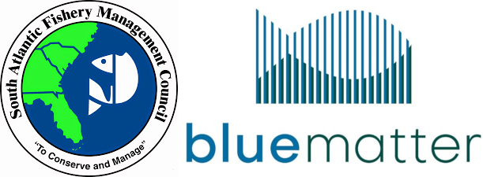

# SAFMC Snapper-Grouper MSE

The [South Atlantic Fishery Management Council](https://safmc.net/) (SAFMC) is working with [Blue Matter Science Ltd.](https://www.bluematterscience.com/) to conduct a [Management Strategy Evaluation (MSE)](https://harveststrategies.org/management-strategy-evaluation-2/) to describe the expected outcomes of different management approaches for the Snapper-Grouper Fishery. More information on the project is available on the [Project Overview](/about) page.

This site will be updated periodically with notes on project progress, background materials, presentations and reports, and other information relating to this project. 

## MSE Technical Group Members

|  Name|  Email|  Role|
|:--|:--|:--|
| Adrian Hordyk	| adrian@bluematterscience.com 	|Lead MSE Analyst |
| Quang Huynh | quang@bluematterscience.com 	|Supporting MSE Analyst |
| Tom Carruthers |	tom@bluematterscience.com	| Supporting MSE Analyst |
| Chip Collier	| chip.collier@safmc.net	|  SAFMC Lead |
| Cassidy Peterson	|	cassidy.peterson@noaa.gov	| MSE Specialist |
| Erik Williams	|	erik.williams@noaa.gov	|  Stock Assessment Specialist |
| Christina Wiegand	| 	christina.wiegand@safmc.net	|  Social Scientist |
| Scott Crosson	|	scott.crosson@noaa.gov	|  Economist |
| Mike Larkin	|	michael.larkin@noaa.gov	| Data Analyst |
| Kai Lorenzen	|	klorenzen@ufl.edu	| Meeting Moderator/Facilitator |
| Mike Schmidtke	| mike.schmidtke@safmc.net | SAFMC Fishery Scientist |
| Judd Curtis	| judd.curtis@safmc.net | SAFMC Fishery Scientist |
| Allie Iberle |	allie.iberle@safmc.net | SAFMC Fishery Scientist |

## MSE Process Documents
- [MSE Trial Specifications](/TS)

## Presentations and Documents

### Snapper-Grouper Advisory Panel Meeting, October 2022

- [Introduction to MSE: Philosophy, Concepts, Terminology and Process](/resources/2022_Oct_Snapper_Grouper_Advisory_Panel/Intro_to_MSE.pdf)
- [An Overview of the MSE Process: A demonstration using the Red Snapper and Gag Grouper](/resources/2022_Oct_Snapper_Grouper_Advisory_Panel/RedSnapper_Gag_demo.pdf)

## Background Documents

### Assessment Reports
- [SEDAR 71 South Atlantic Gag](/docs/SEDAR_Reports/SEDAR_71_SAR_4.19.21_final_withaddendum.pdf)
- [SEDAR 73 South Atlantic Red Snapper](/docs/SEDAR_Reports/SEDAR73_SARedSnapper_FullSAR_V3_0.pdf)

## Additional Resources and Material

- [openMSE](https://openmse.com/): the MSE framework used to conduct the closed-loop simulation testing.

- [The Data-Limited Methods Toolkit (DLMtool): An R package for informing management of data-limited populations](/resources/Methods Ecol Evol - 2018 - Carruthers - The Data‐Limited Methods Toolkit  DLMtool   An R package for informing management.pdf): scientific paper describing the development of the DLMtool package.

