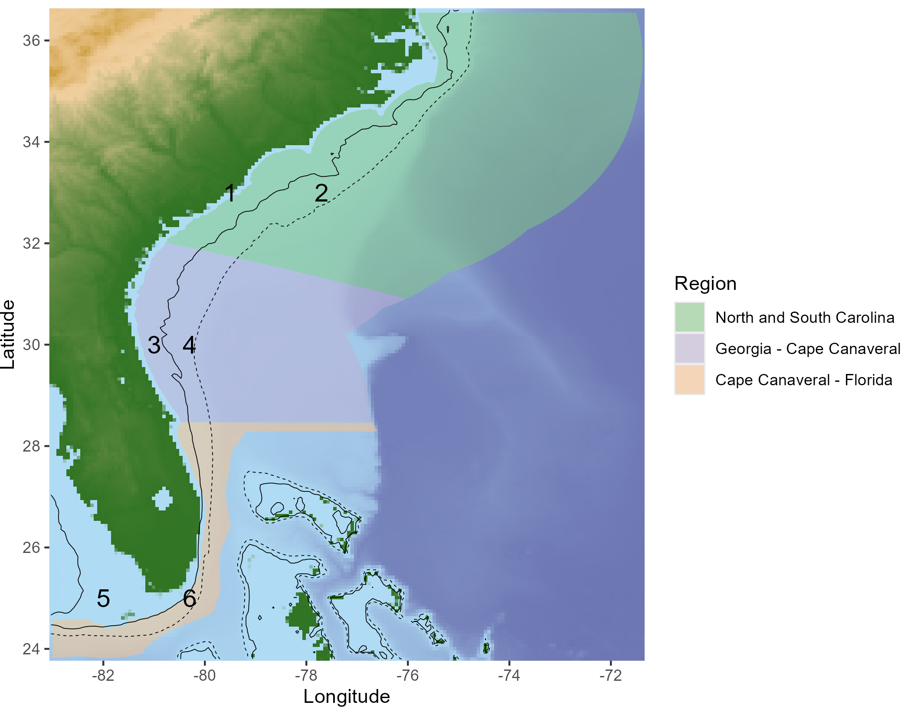
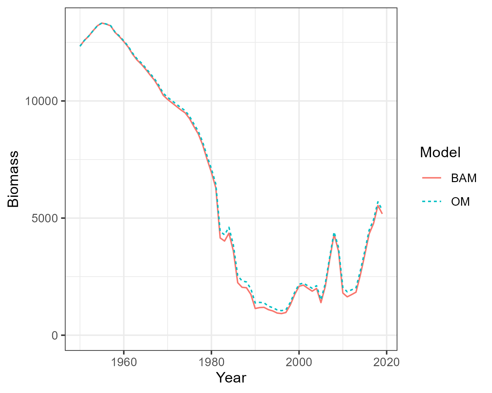
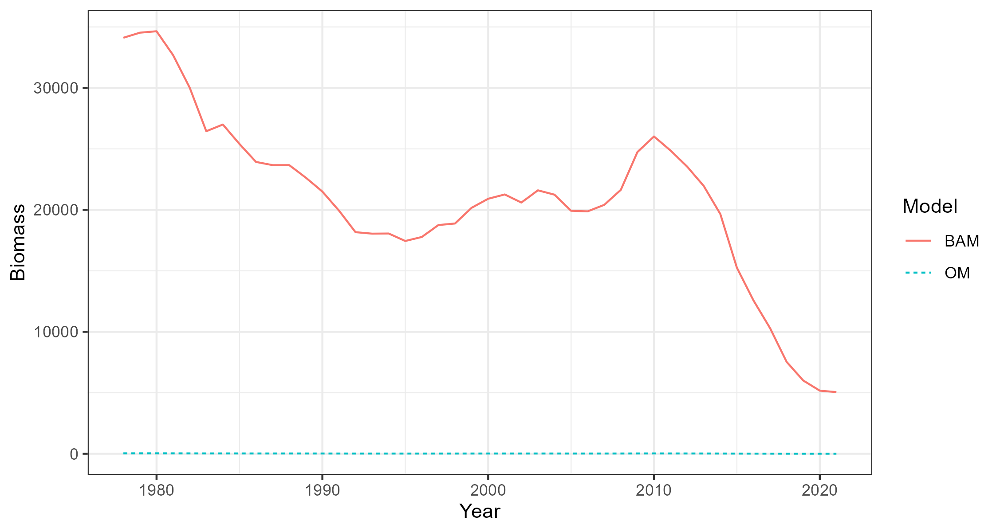

```{r, include = FALSE}
knitr::opts_chunk$set(
  collapse = TRUE,
  comment = "#>"
)
library(knitr)
```

```{r, message=FALSE, warning=FALSE}
library(SAMSE)
```

# Introduction

This article describes the process to import output from the Beaufort Assessment Model (BAM) and create the Base Case multi-species and multi-fleet operating models (OMs) used by the [openMSE](https://openMSE.com) framework.


## Prerequistes

The latest development versions of `MSEtool` and `bamExtras` need to be installed from GitHub:

```{r, eval=FALSE, echo=TRUE}
# install.packages('pak')
pak::pkg_install('nikolaifish/bamExtras')
pak::pkg_install('blue-matter/MSEtool')

```

```{r, include=FALSE, cache=FALSE}
do.call(read_chunk, list(path = '../Run_Analysis/Global_Variables.R'))
do.call(read_chunk, list(path = '../Run_Analysis/Build_Base_Case_OMs.R'))

```

# OM Specifications

The number of simulations (`nsim`) and number of projection years (`proyears`) need to be specified for an OM. Here we are setting them as global variables so that each OM we create has the same number of stochastic simulations and projection years:

```{r, nsim}

```

An OM also requires the specification of an Observation Model. The Observation Model is used to simulate fishery data to be used be management procedures in the projection phase of the closed-loop simulation testing. 

We are using `Perfect_Info` as the fishery data are not currently used within the management options (only static management options are currently being explored). This can be changed later if dynamic management options that respond to the observed fishery data are added to the analysis. 

```{r, Obs_Model}

```

# Case Study Stocks

The current analysis is focused on three stocks: red snapper *Lutjanus campechanus*, gag grouper *Mycteroperca microlepis*, and black seabass *Centropristis striata*. The MSE framework is flexible, and more stocks can be added to the analysis following the same process used here.

Here we demonstrate creating OMs for the three case study stocks.

The most recent BAM assessments are used:
  
1. Red snapper: [SEDAR 73](https://sedarweb.org/documents/sedar-73-stock-assessment-report-south-atlantic-red-snapper/)
1. Gag grouper: [SEDAR 71](https://sedarweb.org/documents/sedar-71-stock-assessment-report-south-atlantic-gag/)
1. Black seabass: [SEDAR 76](https://sedarweb.org/documents/sedar-76-stock-assessment-report-south-atlantic-black-sea-bass/)


# Import SEDAR Assessments

The BAM assessments are imported from the `bamExtras` package:
  
```{r, importBAM, eval=FALSE}

```

# Create Single-Stock Operating Models

The `BAM2MOM` function is used to create the `openMSE` operating model objects:
  
```{r, BAM2OM, eval=FALSE}

```

These OMs could now be used within the `openMSE` framework. However, if we wish to combine the OMs into a single multi-stock OM (or model them individually under the assumption they are being managed together), we need to create a common fleet structure for all OMs.

## Define Fleet Structure

Here we create a data frame with the names of the fleets within each OM:
```{r, fleetnames, eval=FALSE}


```

In order to combine these single stock OMs together, each OM must have the same fleet structure for all
stocks in the OM, even if those fleets are not actively fishing on a particular stock.

The stocks have some fleets in common (e.g., Commercial hook and line (cHL)) and some unique fleets (e.g., Gag Grouper Commercial dive (cDV)). The landings and discards are also modeled as separate fleets in the BAM models (indicated by ".D").

The black seabass stock has two commercial fleets (cHL and cPT), but the discards are reported for two fleets combined (cGN.D). To deal with this, the cHL and cPT landing fleets will first be combined together, before the discards are added for the combined fleet.

```{r, echo=FALSE}
fleet_names_df <- readRDS('../inst/fleet_names_df.rda')
```

Here we create a data frame with `Code`, `Name`, `Mapping`, and `Type` for each fleet:
```{r, fleet_df}

```

`Code` is the name of the fleets within the OM objects. `Name` is the name we are associating with each `Code`. The `Mapping` variable describes how the fleets will be combined together. `Type` indicates if a fleet in the OM represents Landings or Discards.

The Landing and Discard components for each fleet will be combined into a single fleet with a selectivity and retention curve. This makes it easier to model changes to management such as changes to season lengths, discard mortality, or size-based retention or selectivity regulations.

The end result will be a fleet structure with four fleets for each stock:

1. Commercial Line
2. Recreational Headboat
3. General Recreational
4. Commercial Dive

## Define Discard Mortality

The discard mortality needs to be added to the OMs so that the historical effort can be adjusted to account for the fish that were caught and released alive, and so that the discard mortality can be modified in the projections.

The discard mortality for red dnapper is reported in Table 6 of [SEDAR 73](https://sedarweb.org/documents/sedar-73-stock-assessment-report-south-atlantic-red-snapper/). The`Year` variable indicates the first year the discard mortality changes:

```{r, RS_DiscardMort}

```

The discard mortality for Gag Grouper is reported in [SEDAR 71](https://sedarweb.org/documents/sedar-71-stock-assessment-report-south-atlantic-gag/), with a fixed discard mortality of 0.4 for the commerical fleet, and 0.25 for the recreational fleets for all years:

```{r, GG_DiscardMort}


```

The discard mortality for Black Seabass is reported in Section 2.2.1 in [SEDAR 76](https://sedarweb.org/documents/sedar-76-stock-assessment-report-south-atlantic-black-sea-bass/). Here the average discard mortality is calculated for the combined commercial line and pot fleets:

```{r, BS_DiscardMort}

```

The stock-specific discard mortality dataframes are combined together:

```{r, discard_mortality}


```


## Aggregate Fleets

Next, the `Aggregate_Fleets` function is used to aggregate the fleets together according to the mapping defined in `fleet_df` and the discard mortality are added from `discard_mortality`.

The `Aggregate_Fleets` function does five things:

  1. Combine any landing fleets that are mapped together in `fleet_df` (here only applies to Black Seabass)
2. Add the discard mortality to each fleet
3. Combine the discard fleets with the landing fleets to produce a single fleet with selectivity and retention curves
4. Add dummy fleets (F=0 for all years) for OMs that are missing some fleets
5. Order the fleets for all OMs

```{r, Aggregate_Fleets, eval=FALSE}

```

# Add Spatial Structure

The spatial structure of the MSE has been defined as 6 areas, including 3 geographic regions  and a Nearshore (<100ft) and Offshore (>100ft) component for each region (solid and dashed black lines respectively in Figure \@ref(fig:spatialmap)).

```{r, spatial_map, eval=FALSE}

```

```{r spatialmap, fig.cap='Definition of the spatial areas used in the MSE.', echo=FALSE}

```

## Spatial Distribution of Unfished Abundance

The relative abundance of the three stocks was specified using the output of a recent study that estimated the spatiotemporal dynamics of reef fish off the southeastern United States ([Cao et al., 2024](https://esajournals.onlinelibrary.wiley.com/doi/10.1002/ecs2.4868); K. Shertzer personal communication, May 2024).

```{r, Rel_Abun_Area, eval=FALSE}

```

## Add Stock Spatial Structure to OMs

The age-specific relative distribution of each stock across the depth zones was modeled by assuming 100%, 95%, and 80% of age-0, -1, and -2 fish respectively occurred in the nearshore region. 

The depth distribution of age-3+ fish, as well as the relative spatial distribution of the fishing fleets, were then calculated by optimizing the age-3+ stock and the fleet-specific effort spatial distributions such that the relative distribution of the biomass across the six areas in the terminal year of the operating models closely matched the reported relative distribution from the spatiotemporal model (see above).

```{r, Add_Spatial, eval=FALSE}


```


# Generate Correlated Recruitment Deviations for Projections

A multivariate normal distribution (truncated at 2 standard deviations) was used to estimate the variance and auto-correlation in the estimated recruitment deviations, together with the correlation in recruitment deviations between the three stocks. This distribution was then used to generate recruitment deviations for the projection period, maintaining the statistic properties of the historical recruitment deviations estimated in the stock assessments (Figure \@ref(fig:recdevs)).

```{r, RecDevs, eval=FALSE}

```

```{r recdevs, fig.cap='Scatterplots with marginal distributions showing the correlated recruitment deviations used for the projections.', echo=FALSE}
knitr::include_graphics("../man/figures/rec_devs.png")
```


# Compare BAM and OM Dynamics

Three single-stock, multi-fleet operating models have now been created. The next thing is to confirm that the fishery dynamics generated by the operating model are sufficiently close to those estimated in the BAM output.

Here the `Simulate` function is used to simulate the historical fishery dynamics described in the OM, and the
`Compare_Biomass` function creates a plot to compare the biomass from the OM with those from the BAM output.

The plots show that the biomass generated by the OMs closely matches the biomass reported by the stock assessments. The minor differences between the two are caused by the spatial structure being imposed onto the output of a non-spatial stock assessment.

```{r , compareRS, eval=FALSE}

```

```{r, echo=FALSE, fig.width=6}

```


```{r , compareGG, eval=FALSE}

```

```{r, echo=FALSE, fig.width=6}
knitr::include_graphics("../man/figures/GG_compare.png")
```


```{r , compareBS, eval=FALSE}

```

```{r, echo=FALSE, fig.width=6}

```


